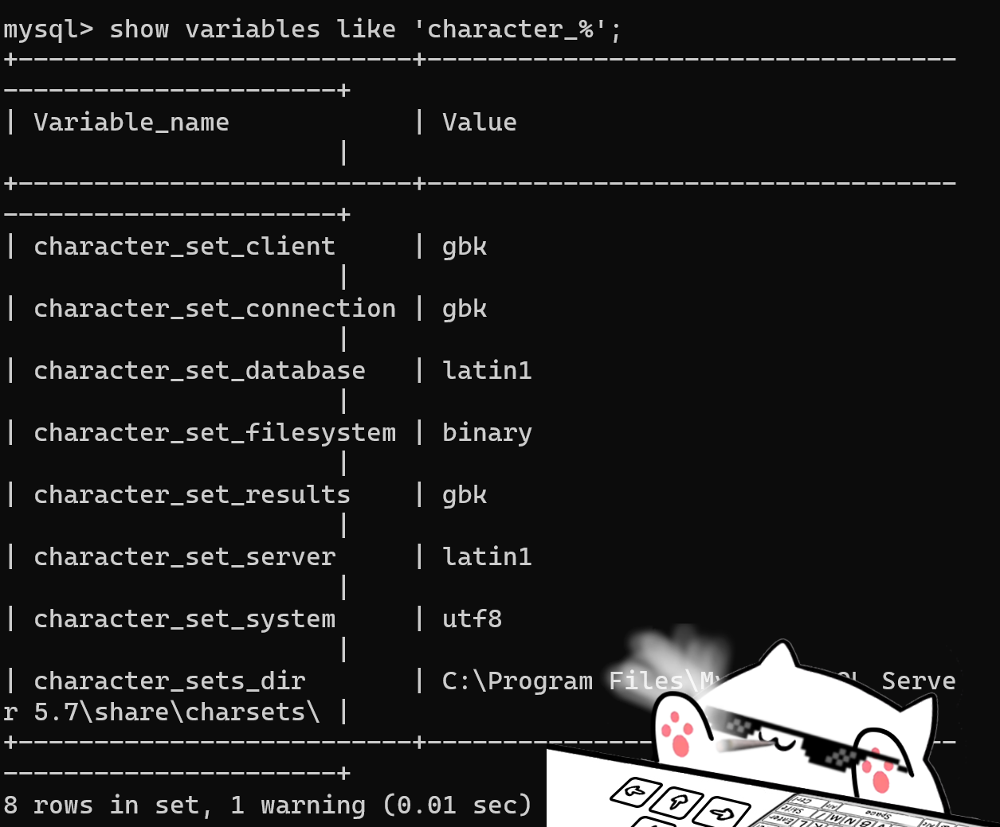
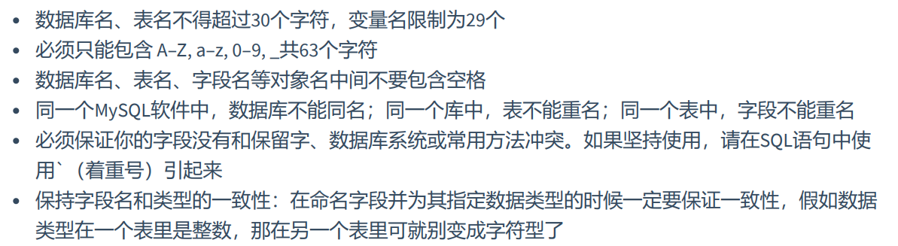
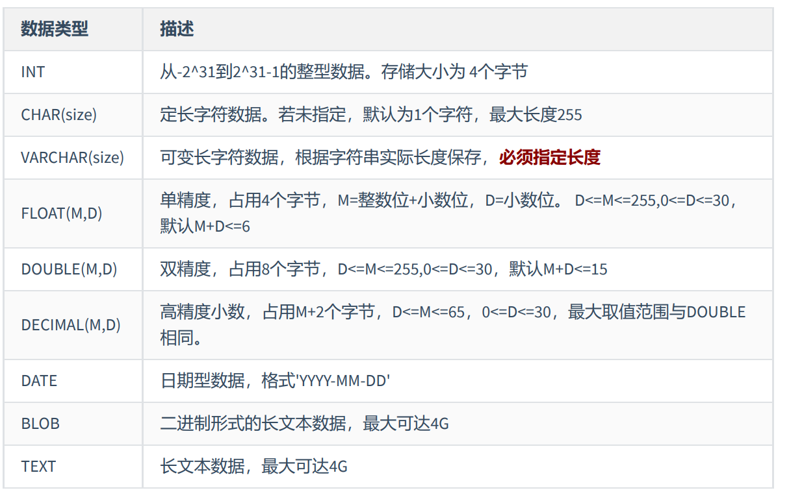
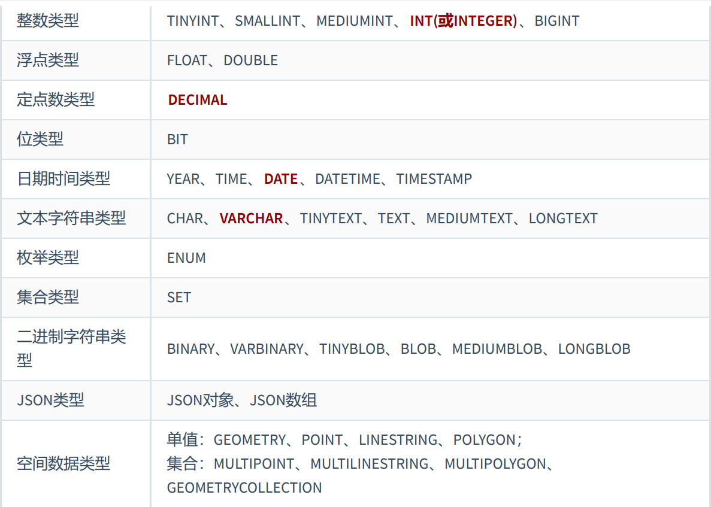
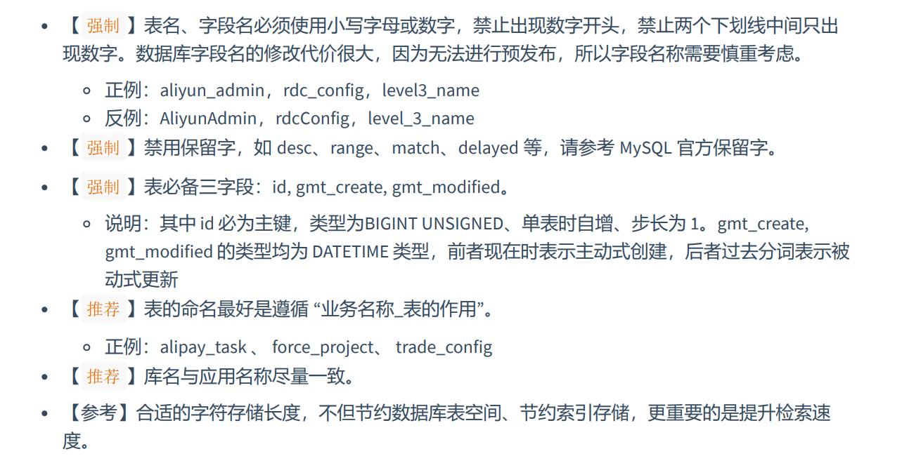
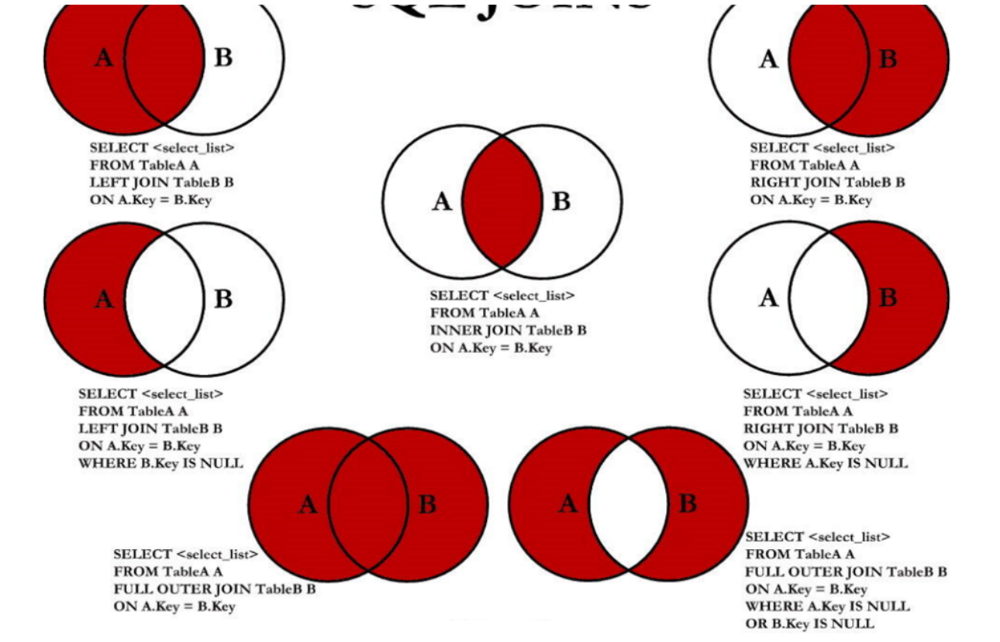

# MySQL&SQL

## RDBMS&非RDBMS

>  对于RDBMS

row+column == table

table+table+……+table == database

> 对于非RDBMS

舍去RDBMS中对于SQL层的解析

key-value

## Object Relational Mapping，ORM，对象映射设计思想

table -- class

row -- object

column -- field（字段）

## Entity-Relationship，E-R模型及关系型数据库设计准则

### 实体集、属性、联系集

实体集class -- 数据库table

实体instance -- 数据库表行row（亦被称作记录record）

属性attribute -- 数据库表列column（亦被称作字段field）

### 表之间的关联关系

表之间的关联关系指的是，表中单一实体的关联。

> 1--1，1--n，n--n，自我引用。

## MySQL8.0Env的搭建及其卸载

> Windows11
>
> 对于MySQL5.7，卸载时需要手动清理注册表，8.0以上无需手动清理
>
> HKEY_LOCAL_MACHINE\SYSTEM\ControlSet001\Services\MySQL服务 
> 		HKEY_LOCAL_MACHINE\SYSTEM\ControlSet002\Services\Eventlog\Application\MySQL服务 
> 		HKEY_LOCAL_MACHINE\SYSTEM\ControlSet002\Services\MySQL服务 
> 		HKEY_LOCAL_MACHINE\SYSTEM\CurrentControlSet\Services\Eventlog\Application\MySQL服务
> 		HKEY_LOCAL_MACHINE\SYSTEM\CurrentControlSet\Services\MySQL服务
>
> >  对于MySQL的安装，需要使用.Net框架

**默认的root账户密码为abc123（配置时指定）**

**默认的MySQL8.0默认端口号为3306**

**安装的MySQL5.7端口号指定为13306**

> 在同一台计算机中，使用如下命令切换不同版本
>
> ```bash
> mysql -uroot -pabc123 -hlocalhost -P3306 # 登录MySQL8.0
> mysql -uroot -pabc123 -hlocalhost -p13306 #登录MySQL5.7
> # -h ： 指定IP，默认为本机
> # -P ： 指定端口号
> ```
>

对于MySQL服务的启动和关闭

> 通过WindowsTerminal/CMD执行`net start/stop`系列命令时，需要赋管理员权限。

```bash
net start mysql80 # mysql服务默认名为mysql+版本号
net start mysql57 # 启动MySQL5.7

net stop mysql80
net stop mysql57
```

## MySQLCMD指令

### 登录

```bash
mysql -u [username] -P[Port] -p +{Enter}
mysql -u root -P13306 -p #回车，并输入密码，进行登录

mysql -u root -P13306 -h[IP] -p+{Enter} # 访问另外IP下的对应端口号的数据库服务器程序
```

### 设定字符集

对于MySQL5.7，默认字符集为Latin-1，非UTF-8，因此默认没有提供对于汉字等非英文字符的保存支持

展示字符集

```mysql
show create table [tablename] #展示创建此表格时的详细信息，包括字符集
show variables like 'character_%' #展示数据库中全部的与'character'(字符集设定)相关的变量
```



编辑my.ini文件中更改MySQL创建数据库的默认行为

my.ini文件位于MySQL数据目录下。

> Windows11 默认 安装路径时，路径为：
>
> C:\ProgramData\MySQL\MySQL Server 5.7\my.ini

进行两处更改

```ini
[mysql]
default-character-set=utf8 #更改默认字符集
[mysqld]
character-ser-server=utf8
collation-server=utf8_general_ci
```

更改之后不会影响已有的数据库的默认字符集

## 变更MySQL8.0的加密策略以适应老驱动进行远程连接

MySQL8.0变更了从前的mysql_native_password加密规则，更改为caching_sha2_password规则。

许多MySQL图像化工具不支持后者。若不更新图形化工具，则需要对MySQL进行设置。

于MySQLCMD下执行

```mysql
use mysql;
#变更MySQL加密规则为mysql_native_password
alter user 'root@localhost' inditified with mysql_native_password by 'abc123';

flush privileges;
```

## Structured Query Language，SQL，结构化查询语言

> SQL-92及SQL-99属于SQL比较重要的两个标准，制定于ANSI
>
> **SQL编码规范：**
>
> > 标准编码缩进、一行或多行编写；
> >
> > 每行以`;`或`\g`或`\G`结束
> >
> > 关键字不能缩写、不可分割。
> >
> > 在Windows下大小写不敏感、在Linux下大小写敏感
> >
> > ----------------
> >
> > 数据库名、表名、别名等小写（不超过30个字符），关键字大写
> >
> > 变量名限制为29个字符
> >
> > 只能包含大小写字母+数字以及下划线
> >
> > 命名中央不要存在空格
> >
> > 同一个MySQL软件中，不允许重复命名
> >
> > 命名不要与保留字相冲突，如果必须使用，使用`引入
> >
> > 保持字段名和类型的一致性

### 向MySQL导入数据

#### 通过MySQLCMD导入

```shell
source [文件路径]
source C:\Users\themi\Desktop\DB\atguigudb.sql
```


### Data Definition Languages，DDL，数据定义语言

> create、drop、alter、rename、truncate
>
> 创建数据结构并且操作这些数据结构
>
> 创建数据库->确认字段->创建数据表->插入数据
>
> 数据库服务器->数据库->数据表
>
> 

#### 创建、更改字符集、删除数据库

```mysql
#使用默认字符集，MySQL8.0默认字符集为utf-8
create database mytest1;
#指定字符集创建数据库
create database mytest2 character set 'utf8';
#针对MySQL5.7一般都要指出字符集
#仅当数据库不存在时创建数据库
create database if not exists mytest1;
#查看创建表的语言结构
show create database mytest1;

#查看数据库
show databases;
#查看当前使用的数据库
select database()
from dual;
#切换数据库
use mytest1;
#查看表
show tables;
show tables from atguigudb;

#修改数据库---通常不会进行更改数据库，需要付出的代价过于昂贵
#修改数据库字符集
alter database mytest1 character set 'utf8';
#数据库不能改名！

#删除数据库
#删除数据库的行为一般无法进行回滚
drop database mytest1;
drop database if exists mytest1;

drop database mytest2;
drop database if exists mytest2;
```

#### 数据类型及其辨析

[MySQL数据类型辨析]: 《MySQL数据库及数据库基础》.assets/MySQL数据类型.pdf





#### 创建、删除、更改数据表

```mysql
use atguigudb;
show create database atguigudb;
show tables;


#需要用户存在创建表的权限
#创建数据表
#1.创建全新的表
create table if not exists myemp1
(
    id        int,         #包负数
    emp_name  varchar(15), #vachar定义字符串需要在定义的时候指定长度
    hire_date date
);

desc myemp1;
#查看建表语句
show create table myemp1;
#默认使用utf8mb64（数据库的字符集）

#2.基于现有的表创建数据表
#从已有的表中选取一部分字段创建新的表
#同时会导入基表中的数据
select *
from myemp2;

create table myemp2 as
#此处的select可以使用DCL中的全部语法，返回一个子表
select employee_id, last_name, salary
from atguigudb.employees;

desc myemp2;

#此处的select可以使用DCL中的全部语法，返回一个子表
#查询语句中字段的别名，可以作为新创建表的字段的名称
#此处的sel语句结构可以十分丰富
create table myemp3
as
select e.employee_id, e.last_name, d.department_id
from employees e
         join departments d on e.department_id = d.department_id;

select *
from myemp3;

#使用create进行表完全的表结构以及数据复制
#需求：创建employees_copy实现对employees表的复制
create table employees_copy
as
select *
from employees;

select *
from employees_copy;

#需求：创建employees_blank实现对employees表的复制，不包/含基表的数据
create table employees_blank
as
select *
from employees
where 1 = 2;
#添加一个绝对返回false的过滤条件、将所有的数据筛除掉

#添加字段
alter table myemp1
    add salary double(10, 2);
#默认添加到表尾。
#double(整个长度,小数点后有几位)
desc myemp1;

alter table myemp1
    add phone_number varchar(20) first;
desc myemp1;
#添加字段到表首
alter table myemp1
    add email varchar(45) after emp_name;
#添加字段到指定列的后边
desc myemp1;


#修改字段 长度、默认值、类型
#修改数据长度
alter table myemp1
    modify emp_name varchar(25);

alter table myemp1
    modify emp_name varchar(35) default 'aa';
#重命名字段
alter table myemp1
    change salary monthly_salary double(10, 2);

alter table myemp1
    change email my_email varchar(50);
#在重命名字段的时候可以直接修改字段的长度


#删除字段
alter table myemp1
    drop column my_email;
desc myemp1;


#重命名表
rename table myemp1 to myemp11;
show tables;

alter table myemp2 rename to myemp12;
show tables;


#删除表
#删除表结构、同时删除表中的数据
drop table myemp12;
show tables;

drop table if exists myemp12;
show tables;


#清空表
#删除表中的全部数据、但是保留表结构
select *
from employees_copy;

truncate table employees_copy;


#DCL,commit\roll back
#commit执行之后、提交数据、永久保存、不可以回滚
#roll back回滚数据、一旦执行rollback 可以实现数据的回滚、回滚到最近的一次commit之后


# truncate & delete
# 都可以实现对表中数据全部数据的删除、并保留表结构
# truncate table 清除表所有中的数据、并且不可以回滚
# delete from 清除表中部分的数据，可以回滚

/**
  DDL & DML
  DDL一旦执行、就不可以回滚。如truncate table ，set autocommit = false对DDL无用
  DDL在执行完毕之后必然会自动执行一次commit，无法修改。
  DML默认情况下 autocommit  = true，此时操作不可回滚，如果此时在执行之前 set autocommit = false，此时的DML操作可回滚
 */

#truncate table 速度比 delete速度更快、使用的系统和事务日志资源更少，但是truncate 没有事务并且不触发trigger，有可能造成事故。不建议在开发中使用

commit;#记录回滚点

select *
from myemp3;

set autocommit = false;

delete
from myemp3;

rollback;
#回滚至144


#Pra

#1.
create database test01_office character set 'utf8';
show databases;
use test01_office;

create table dept01
(
    id   int(7),
    NAME varchar(25)
);

show tables;

create table dept02
as
select *
from atguigudb.departments;

show tables;

select *
from dept02;


create table emp01
(
    id        int(7),
    firstname varchar(25),
    last_name varchar(25),
    dept_id   int(7)
);

desc emp01;

alter table emp01
    modify last_name varchar(50);

create table emp02
as
select *
from atguigudb.employees
where false;

select *
from emp02;


drop table emp01;

show tables;

rename table emp02 to emp01;

alter table emp01
    add test_column varchar(10);
alter table dept02
    add test_column varchar(10);

desc test01_office.emp01;
desc dept02;

commit;

desc test01_office.emp01;

# alter table test01_office.emp01
#     drop column department_id;


#2.
create database if not exists test02_market;

use test02_market;

create table if not exists customers
(
    c_num     int,
    c_name    varchar(50),
    c_contact varchar(50),
    c_city    varchar(50),
    c_birth   date
);
desc customers;

alter table customers
    drop column c_contact;

alter table customers
    add c_contact varchar(50) after c_birth;


# alter table customers
#     modify c_contact varchar(50) after c_birth;


alter table customers
    modify c_name varchar(70);

alter table customers
    change c_contact c_phone varchar(50);

desc customers;

alter table customers
    add c_gender char(1) after c_name;

desc customers;

rename table customers to custmoers_info;
show tables;


#3.

create database test03_company;
use test03_company;

create table if not exists offices
(
    officeCode int,
    city       varchar(30),
    address    varchar(50),
    country    varchar(50),
    postalCode varchar(25)
);

create table if not exists employees
(
    empNum    int,
    lastName  varchar(50),
    firstName varchar(50),
    mobile    varchar(25),
    `code`    int,
    jobTitle  varchar(50),
    birth     date,
    note      varchar(255),
    sex       varchar(5)
);

desc employees;
alter table employees
    modify mobile varchar(25) after `code`;


alter table employees
    change birth birthday date;

alter table employees
    modify sex char(1);


alter table employees
    drop column note;

alter table employees
    add favorite_activity varchar(100);

rename table employees to employees_info;


show tables ;
desc employees_info;
```

#### SQL命名规范



### Data Manipulation Languages，DML，数据操纵语言

> 所有的DML执行完毕之后会自动执行`commit`
>
> 如果不希望进行如此操作需要在DML执行前
>
> ```mysql
> set autocommit = false;
> ```
>
> 

#### DML语句的执行过程

##### 一般DML的声明过程

```mysql
select distinct...
from ... (join...on...)
where ...
group by ... #不能接入子查询
having...
order by...
limit ... #不能接入子查询
```

##### 一般DML的执行过程

```mysql
#1批次
from.../*1.默认进行cross join*/
(join/*3.由left/right join决定对2.产生的数据进行补充修饰*/...
 on.../*2.根据on中的条件过滤1.中生成的笛卡尔积*/)
where.../*4.对3.中的结果集进行条件过滤*/
group by.../*5.指定需要根据何种字段对4.中的结果集进行分组*/
having.../*6.对5.中产生的 分组 进行过滤*/
#2批次
select.../*7.根据指定字段选取需要数据*/distinct/*8.根据需要去除重复行*/
#3批次
order by.../*9.进行排序显示*/
limit.../*10.进行分页显示*/
```

##### 在Where中声明字段过滤条件比在Having中声明的效率更高的原因

参照上述一般DML的执行过程

`where`直接对数据进行过滤，不需要对数据进行分组而`having`首先需要对数据进行分组

> insert、delete、update、select
>
> 创建数据项，并对数据项进行操作。
>
> 如增删改查。
>
> 如下笔记采用演绎式方法记录知识要点
>
> 演绎式：提出问题-->解决问题-->提出问题-->解决问题
>
> 归纳式：总-->分-->总

#### Select，查询

```mysql
use atguigudb;

select 1 + 1
from dual;
# dual 伪表，相当于一个占位符，凑齐select……from语句

select *
from employees;
# * 表中全部的字段 field

select employee_id, last_name, salary
from employees;
# 指定需要选出的字段并选出

select employee_id emp_id, last_name as lname, department_id "部门ID", salary * 12 "annual sal"
from employees;
# 为生成的结果集中的字段重新命名
# as: alias，添加as关键字
# 等同于在数据集中的数据项名后加空格
# 等效于空格后使用双引号引开（不要使用单引号）

select distinct department_id
from employees;
# 都有那些部门呢？
# 添加 distinct,去除重复行

select *
from employees;

# null值参与运算，值必然是null
select employee_id, salary "月工资", salary * (1 + commission_pct) * 12 "年工资", commission_pct
from employees;


select employee_id, salary "月工资", salary * (1 + ifnull(commission_pct, 0)) * 12 "年工资", commission_pct
from employees;
# 将null视做整数0来处理。

select *
from `order`;
# 着重号`，表名与保留字重复，应使用着重号表明

select '尚硅谷', 123, employee_id, last_name
from employees;
# 查询常数，查询常数会自动生成于查询出来的结果集的每一个数据项中

describe employees;
# 显示表中字段的相关信息
# describe 等同于 desc
```

#### Where，过滤

> where中不允许出现列的别名
>
> > 对于标准的
> >
> > ```mysql
> > select ...
> > from ...
> > where ...
> > order by ...
> > limit ...
> > ```
> >
> > 结构SQL代码，最先执行的是from语句，获取目标表，然后是where语句，从目标表中依照过滤条件过滤信息。其后才执行select语句。在where首次执行时，select中定义的别名并不生效。

```mysql
use atguigudb;
# 使用当前测试用数据库

# 需求：查询90号部门的员工信息
select *
from employees;
# 结果集中包含全部的员工信息
select *
from employees
where department_id = 90;
# 在where后指定过滤条件

# 需求：获取last_name字段为'King'的员工信息
select *
from employees
where last_name = 'king';
# Windows下SQL不区分大小写

# 需求：查询员工12个月的工资总和，并起别名为annual salary
select employee_id, salary * (1 + ifnull(commission_pct, 0)) * 12 "annual salary"
from employees;
# 需求：查询employee表中去除重复的job_id以后的数据
select distinct job_id
from employees;
# 需求：查询工资大于12000的员工的姓名和工资
select first_name, last_name, salary
from employees e
where salary >= 12000;
# 需求：查询员工号为176的员工的姓名和部门号
select first_name, last_name, department_id
from employees
where employee_id = 176;
# 需求：显示表departments的结构，并查询其中全部的数据
describe departments;
select *
from departments;

# 算数运算符
# + - * / div % mod

select 100, 100 + 0, 100 - 0, 100 + 50, 100 + 50 * 30, 100 + 35.5 + 100 - 35.5
from dual;

select 100 + '1'
from dual;
# SQL中 + 没有链接的作用，会将字符串进行隐式转换，变更为数值类型

select 100 + 'a'
from dual;
# a不能隐式转换为数值、直接处理为0

select 100 + null
from dual;
# 结果为null

select 100,
       100 * 1,
       100 * 1.0,
       100 div 1.0,
       100 / 2,
       100 + 2 * 5 / 2,
       100 / 3,
       100 / 0
from dual;
# 除法计算会默认将运算的结果处理成浮点数
# 若计算非法则会产生null值

select 12 % 3, 12 % 5, 12 mod -5, 12 % 5, -12 % -5
from dual;
# 取模运算


#比较运算符
#真返回1，假返回0，其他情况返回null
# = <=> <>/!= < <= > >=
# <=>安全等于，严格的比较两端的值，可以判断null

select 1 = 2, 1 != 2, 1 = '1', 1 = 'a', 0 = 'a'
from dual;

select 'a' = 'a', 'ab' = 'ab', 'a' = 'b'
from dual;
# 两个字符串对比的时候会直接比较这两个字符换的ansi值

select 1 = null, null = null
from dual;

select null <=> null
from dual;
# 返回1

# 需求：查询表employees中commission_pct为null的字段
select employee_id
from employees
where commission_pct <=> null;

# 关键字运算符
# isnull()\is notnull\is null 与null的比较
select *
from employees
where commission_pct is null;
select *
from employees
where commission_pct is not null;
select *
from employees
where not commission_pct <=> null; # 等效于上述is not null
select *
from employees
where isnull(commission_pct);

#least() \ greatest()

select least(first_name, last_name)
from employees;

#between...and
#between...and 选取的空间是闭区间
#between下界 and 上界
#需求：查询工资在6000-8000的员工信息

select *
from employees
where salary between 6000 and 8000;

select *
from employees
where salary >= 6000
  and salary <= 8000;
# and 等效于&&

#需求：查询工资不在6000-8000的员工信息
select *
from employees
where salary not between 6000 and 8000;


#in (set) /not in (set)
#后接一个集合，判定值是否在查询集里
select last_name, salary, department_id
from employees
where department_id in (10, 20, 30);

#需求：查询工资非6000,7000,8000的员工信息
select *
from employees
where salary not in (6000, 7000, 8000);


#like 模糊查询 后接一个正则表达式串
# % 表示任意数量的任意字符
# 查询last_name字段中含有a的全部数据项
select last_name
from employees
where last_name like '%a%';

#需求：查询last_name中包含字符'a'并且包含字符'e'的全部信息
select last_name
from employees
where last_name like '%a%' && last_name like '%e%';

select last_name
from employees
where last_name like '%a%e%' || last_name like '%e%a%';

# _ 代表一个不确定的字符
#需求：查询第二个字符是'a'的员工信息
select last_name
from employees
where last_name like '_a%';

#转义字符'\' 默认
#需求：查询第二个字符是'_'并且第三个字符是'a'的员工信息
select last_name
from employees
where last_name like '_\_a%';

#转义字符可以自定义
select last_name
from employees
where last_name like '_$_a%' escape '$';

#Reg正则表达式，高度精确的字符匹配
# TODO


#逻辑运算符
#&& || ! XOR
#and or not xor

#位运算符
#TODO


#对于运算符的练习
#需求：选择工资不在5000-12000的员工的姓名和工资
select first_name, last_name, salary
from employees
where salary not between 5000 and 12000;

#需求：选择在20号或50号部门工作的员工姓名和部门号
select first_name, last_name, department_id
from employees
where department_id in (20, 50);

#需求：选择工资中没有管理者的员工姓名以及job_id
select *
from employees;

select first_name, last_name, job_id
from employees
where manager_id is null;

#需求：选择公司中有奖金的员工姓名，工资和奖金级别
select *
from employees;

select first_name, last_name, salary, commission_pct
from employees
where commission_pct is not null;

#需求：选择姓名中有字母a和k的员工姓名
select first_name, last_name
from employees
where concat(first_name, last_name) like '%a%k%' || concat(first_name, last_name) like '%k%a%';

#需求：选择姓名第三个字母是a的员工姓名
#下划线表示一个字符
select first_name, last_name
from employees
where concat(first_name, last_name) like '__a%';

#需求:查询表employees中first_name字段以'e'结尾的员工信息
select *
from employees
where first_name regexp 'e$';

#需求：查询表employees中部门编号在80-90之间的姓名、工种

desc employees;
select first_name, last_name, job_id
from employees
where department_id between 80 and 90;


#需求：查询表employees的manager_id是100、101、110的员工的姓名、工资、管理者ID

select first_name, last_name, salary, manager_id
from employees
where manager_id in (100, 101, 110);
```

#### Order By，排序 & Limit，分页

```mysql
use atguigudb;
# 启用测试用数据库

#order by 排序
# asc 升序排列 desc 降序排列
# 默认结果集顺序为数据库添加数据的顺序显示
# 对于数值类型，默认的顺序为从小到大

select *
from employees
order by employee_id desc;

#需求：按照salary字段从高到低来排序结果集
select *
from employees
order by salary desc;

# order by语句可以使用 列的别名来进行排序
select employee_id, salary, salary * 12 `annual sal`
from employees
order by `annual sal`;

# 二级排序
# 需求：显示员工信息，按照department_id降序排列，然后按照salary升序排列
# 多级排序时，只有第一排序条件相同时才会考虑第二排序条件，并按照第二排序条件进行排序

select *
from employees
order by department_id desc, salary asc;


# 分页查询 Limit 偏移量，记录数量
# 其他数据库中的分页查询方法略有不同
# limit pageNumber-1 * pageSize,pageSize

#需求：每一页返回20条记录，显示第一页数据
select employee_id, last_name
from employees
limit 0,20;

#需求：每一页返回20条记录，显示第二页数据
select employee_id, last_name
from employees
limit 20,20;

#需求：每一页返回20条记录，显示第三页数据
select employee_id, last_name
from employees
limit 40,20;

#select from where order by limit,limit存在于尾部

#需求：仅显示第32以及第33条数据
select *
from employees
limit 31,2;


#MySQL8.0中Limit可以组合 offset使用

select *
from employees
limit 2 offset 31;


#需求：查询员工表中工资最高的员工信息
select employee_id, last_name, salary
from employees
order by salary desc
limit 0,1;

select employee_id, last_name, salary
from employees
order by salary desc
limit 1 offset 0;


# 需求：查询员工姓名和部门号以及年薪，按照年薪降序排列，按照姓名升序显示
select concat(first_name, last_name) `姓名`, department_id `部门号`, salary * 12 `年薪`
from employees
order by `年薪` desc, `姓名` asc;

# 需求：选择工资不在8000-17000的员工的姓名和工资，按照工资降序，显示第21-40位置的数据
select concat(first_name, last_name) `姓名`, department_id `部门号`, salary `工资`
from employees
# where not (salary <= 17000 && salary >= 8000)
where salary not between 8000 and 17000
order by `工资` desc
limit 20,20;

# 需求：查询邮箱中包含e的员工信息，并先按照邮箱的字节数降序，再按照部门号升序
select *
from employees
where email like '%e%'
# 获取字段的字节数 length 单行函数，返回邮箱的字节数
order by length(email) desc, department_id asc;
```

#### 多表/关联查询

##### 笛卡尔积/交叉连接

$$
集合X:\{a,b,c\}与集合Y:\{d,e,f\}作笛卡尔积\\S:\{ad,ae,af,bd,be,bf,cd,ce,cf\}\\
结果集S中的结果数量为X与Y中元素数量的乘积
$$


在多表查询中如果未指定两个表连接的条件，会默认返回笛卡尔积，造成错误

每两张表，至少就需要一个连接条件

##### 多表查询的分类

- 等值连接 & 非等值连接
- 自连接 & 非自连接
- 内连接 & 外连接

###### 六种外连接以及一种内连接



```mysql
use atguigudb;

desc employees;
desc departments;
desc locations;

#需求：从多个表中获取数据，查询某个员工在哪个城市工作，以员工名'Abel'为例

#以单表形态查询此信息，占用了三次交互
select *
from employees
where last_name = 'Abel';

select *
from departments
where department_id = 80;

select *
from locations
where location_id = 2500;

#以多表查询形态实现上述需求
# TODO
select emp.employee_id, concat(emp.first_name, emp.last_name), loca.city
from employees emp,
     departments dept,
     locations loca
where emp.department_id = dept.department_id && dept.location_id = loca.location_id
  and concat(emp.first_name, emp.last_name) like '%Abel%';


#需求：获取员工id、部门id以及部门名称三个字段

#笛卡尔积/交叉连接错误 ：缺少正确的连接条件
select employee_id, department_name
from employees,
     departments;
select employee_id, department_name
from employees
         cross join departments;

#附加正确的连接条件
#从SQL优化的角度——要指明查询的字段位于哪个表中
select employees.employee_id, employees.department_id, departments.department_name
from employees,
     departments
where employees.department_id = departments.department_id;

#给表赋别名 于 select where中使用
#若表有别名，则在select 及 where中必须使用别名，若存在别名时，仍使用表明则会产生错误
select emp.employee_id, emp.department_id, dept.department_name
from employees emp,
     departments dept
where emp.department_id = dept.department_id;


#需求：查询员工的员工id，姓名，部门名，城市名
#每两张表就需要一个连接条件
select emp.employee_id, concat(emp.first_name, emp.last_name), dept.department_name, city.city
from employees emp,
     departments dept,
     locations city
#三张表，两个连接条件
where emp.department_id = dept.department_id
          && dept.location_id = city.location_id;


#非等值连接
select concat(emp.first_name, emp.last_name), emp.salary, job.grade_level
from employees emp,
     job_grades job
where emp.salary between job.lowest_sal and job.highest_sal;

#自连接，不同表之间的连接就是非自连接
#需求：查询员工姓名及其管理者姓名和id
#自己连接自己
desc employees;
select emp.employee_id,
       concat(emp.first_name, emp.last_name),
       man.employee_id,
       concat(man.first_name, man.last_name)
from employees emp,
     employees man
where emp.manager_id = man.employee_id;


#内连接
#典型内连接
#将左表以及右表中满足连接条件的数据项返回，是为内连接
#仅返回106行数据
#此为SQL92语法实现的典型内连接
select employee_id, dept.department_name
from employees emp,
     departments dept
where emp.department_id = dept.department_id;

#使用SQL-3/SQL99语法实现典型内连接
#内连接多个表
select emp.last_name, d.department_name, l.city
from employees emp
         join departments d on d.department_id = emp.department_id
         join locations l on d.location_id = l.location_id;

#外连接
#在内连接的基础上，还返回左表和或右表中不匹配的行
#仅返回左表中不匹配的行是为 左外连接
#仅返回右表中不匹配的行是为 右外连接
#同时返回左表和右表中不匹配的行是为 满外连接

#实现外连接的语法在SQL92(SQL-2标准)以及SQL99(SQL-3标准)中都有所不同

#需求：查询所有员工的last_name以及dept_name两个字段信息

# 使用SQL-2标准/SQL92实现
# MySQL不支持SQL92语法实现外连接，下述代码可以在Oracle中执行
# 实现左外连接在右表尾部添加(+)
# 实现右外连接在左表尾部添加(+)
# select emp.last_name, dept.department_name
# from employees emp,
#      departments dept
# where emp.department_id = dept.department_id(+);
## where dept.department_id(+) = emp.department_id; #实现右外连接


# 使用SQL-3标准/SQL99实现
# 使用join ...on
# MySQL仅支持SQL99式的外连接
# 实现左外连接
# left outer join 等效于 left join
# right outer join 等效于 right join
select emp.last_name, dept.department_name
from employees emp
         left outer join departments dept on emp.department_id = dept.department_id;


#以SQL-3实现满外连接
#MySQL不支持SQL-3标准的满外连接
#Oracle支持SQL-2以及SQL-3标准的全部语法
# select emp.last_name, dept.department_name
# from employees emp
#          full  outer join departments dept on emp.department_id = dept.department_id;

select emp.last_name, dept.department_name
from employees emp
         left outer join departments dept on emp.department_id = dept.department_id;

# union 合并结果集 并去除重复记录
# union all 合并结果集 保留重复记录 —— union的效率比union all的要低
#TODO


#六种外连接形式的实现 TODO


#SQL-3/SQL99支持的 自然连接
#自然连接会自动查询两张连接表中的等值字段，然后进行等值连接
select *
from employees e
         join departments d on d.department_id = e.department_id and e.manager_id = d.manager_id;
#等效于上述写法
select *
from employees e
         natural join departments d;

#SQL-3/SQL99支持的 using
#using不适用于自连接
select *
from employees e
         join departments d using (department_id);
#等效于上述写法，使用using语法替代等值的连接字段条件，要求两张表的等值字段名相同
select *
from employees e
         join departments d on d.department_id = e.department_id;


#需求：显示所有员工的姓名，部门号，部门名称
desc employees;
desc departments;

select concat(e.first_name, e.last_name), e.department_id, d.department_name
from employees e
         left join departments d on e.department_id = d.department_id;

#需求：查询90号部门员工的job_id以及部门的location_id
desc locations;

select e.job_id, d.location_id, concat(e.first_name, e.last_name)
from employees e
         join departments d on e.department_id = d.department_id
where e.department_id = 90;


#需求：选择所有有奖金的员工的last_name,department_name,location_id,city

select e.last_name, d.department_name, l.location_id, l.city
from employees e
         left join departments d on e.department_id = d.department_id
         left join locations l on d.location_id = l.location_id
where e.commission_pct is not null;

#需求：选择city在Toronto工作的员工的last_name,job_id,department_id,department_name
select e.last_name, e.job_id, e.department_id, d.department_name
from employees e
         join departments d on e.department_id = d.department_id
         join locations l on d.location_id = l.location_id
where l.city = 'Toronto';


#需求：查询员工所在的部门名称、部门地址、姓名、工作、工资，其中员工所在部门的部门名称为’Executive’
select d.department_name, l.city, concat(e.first_name, e.last_name), j.job_title, e.salary
from employees e
         join departments d on d.department_id = e.department_id
         join locations l on d.location_id = l.location_id
         join jobs j on e.job_id = j.job_id
where d.department_name = 'Executive';

#需求：选择指定员工的姓名，员工号，以及他的管理者的姓名和员工号，结果类似于下面的格式
# employees Emp# manager Mgr#
select concat(e.first_name, e.last_name) `employees`,
       e.employee_id                     `Emp`,
       concat(m.first_name, m.last_name) `manager`,
       m.employee_id                     `Mgr`
from employees e
         left join employees m on e.manager_id = m.employee_id;


select *
from employees;

#需求：查询哪些部门没有员工
#对应3/4号外连接
select *
from departments d
         left join employees e on d.department_id = e.department_id
where e.department_id is null;
# 可以使用子查询实现


#需求：查询哪个城市没有部门
#对应3/4号外连接
select l.city
from locations l
         left join departments d on l.location_id = d.location_id
where d.location_id <=> null;

desc locations;
desc departments;


#需求：查询部门名为 Sales 或 IT 的员工信息
desc departments;
select e.employee_id, concat(e.first_name, e.last_name)
from employees e
         join departments d on e.department_id = d.department_id
where department_name = 'Sales' || d.department_name = 'IT';
```

#### MySQL中的函数

[单行函数]: 《MySQL数据库及数据库基础》.assets/MySQL单行函数.pdf	"单行函数"
[聚合/多行函数]: 《MySQL数据库及数据库基础》.assets/MySQL多行函数.pdf	"多行函数"

```mysql
#流程控制函数
#需求：查询部门号为10，20，30的员工信息，若部门号为10，打印其工资的1.1倍，20号为1.2倍，30号部门为1.3倍

select employee_id,salary,
       case department_id
           when 10 then salary * 1.1
           when 20 then salary * 1.2
           when 30 then salary * 1.3
           else salary end "Total Salary"
from employees
where department_id in (10,20,30);


#需求：调用日期函数显示系统时间
select concat(curdate(),' ',curtime())
from dual;

#需求：查询员工号、姓名、工资以及工资提高20%之后的结果 new salary
select employee_id,concat(first_name,last_name) "name",salary,salary*1.2 "new salary"
from employees;

#需求：将员工的姓名按照首字母排序，返回姓名长度length
#TODO 如何实现按首字母排序？
select concat(first_name,last_name) name,length(concat(first_name,last_name))
from employees;
#需求：查询员工id，last_name，salary并作为一个列输出，别名为out_put
select concat_ws(' ',employee_id,last_name,salary) out_put
from employees;


#需求：查询公司各员工工作年数、工作的天数、并按工作年数降序排序
#TODO 这些数据在哪个表里？
select *
from employees;
```

##### 聚合函数

###### 常用聚合函数

```mysql
AVG SUM #返回平均值、和，当然仅适用于数值类型的数据 SUM以及AVG求值自动过滤空值
MAX MIN #返回最大值、最小值 适用于数值类型、字符串类型、事件类型等
COUNT #计数 统计NULL
count(*) === count(10) == count(field_name)
#count(fieldname)仅返回字段非null的行
#对于MyISAM，三者效率相同，MyISAM存在一个字段用来维护字段数O(1)
#对于InnoDB，*===1 > field_name
#返回 方差、标准差、中位数
```

#### Group By，分组

使用Having，对Group By的过滤

```mysql
use atguigudb;


#需求：获取emp表中各个部门的平均工资
select department_id, avg(salary), max(salary)
from employees
group by department_id;

#需求：获取emp表中各个部门、各个工种(job_id)的平均工资
select department_id, job_id, avg(salary)
from employees
group by department_id, job_id;

#对于group by，select后出现的非聚合函数字段必须同时出现在group by后面

select department_id, job_id, avg(salary)
from employees
group by department_id, job_id
with rollup;
#计算完平均值会重新计算一次整体数据的平均值

#with rollup 和 order by不能同时出现


#需求：查询各个部门中最高工资比10000更高的部门
#1.使用Having对group by的结果进行过滤
#2.过滤条件中存在聚合函数，必须使用having，不可使用where
select department_id
from employees
group by department_id
having max(salary) > 10000;


#需求：查询部门id为10,20,30,40这4个部门中最高工资比10000高的部门信息
#过滤条件中存在聚合函数时，必须声明于group by中。若无，则声明于where以及having中都可以。但是where的效率更高
#方式一
select department_id
from employees
where department_id in (10, 20, 30, 40)
group by department_id
having max(salary) > 10000;
#第二种实现方式，执行效率低于方式一
select department_id
from employees
group by department_id
having max(salary) > 10000 && department_id in (10, 20, 30, 40);

#Where子句不允许使用聚合函数过滤
#需求：查询公司员工工资的最大值、最小值、平均值、总和
select max(salary), min(salary), avg(salary), sum(salary)
from employees;
#需求：查询job_id员工工资的最大值、最小值、平均值、总和
select job_id, max(salary), min(salary), avg(salary), sum(salary)
from employees
group by job_id;
#需求：查询各个job_id的员工总人数
select count(*), job_id
from employees
group by job_id;

#需求：查询员工最高工资和最低工资的差距 diff
select max(salary), min(salary), max(salary) - min(salary) `DIFF`
from employees;

#需求：查询各个管理者手下员工的最低工资，其中最低工资不能低于 6000，没有管理者的员工不算在内
select min(salary)
from employees
where not manager_id <=> null
group by manager_id
having min(salary) > 6000;

#需求：查询所有部门的名字,location_id,员工数量、平均工资并按照平均工资降序排列
#难点：有些部门没有员工，count(*)会将值为null的同时统计进来，如何解决？
#将员工按照department_id分组之后，内部的数据主键体现为employee_id
select d.department_name, d.location_id, count(employee_id), avg(salary) avs
from employees
         right join departments d on employees.department_id = d.department_id
group by d.department_name, d.location_id
order by avs desc;

#需求：查询每个工种、每个部门的部门名、工种名以及最低工资
select j.job_title, d.department_name, min(salary)
from employees
         right join jobs j on employees.job_id = j.job_id
         right join departments d on employees.department_id = d.department_id
group by j.job_title, d.department_name;
```

#### Sub Query,子查询

```mysql
use atguigudb;

#子查询，嵌套结果集
#需求：查询工资比Abel高的员工信息

#部分子查询可以使用自连接进行代替
select e1.last_name, e1.salary
from employees e1
         join employees e2 on e1.salary > e2.salary && e2.last_name = 'Abel';


#子查询
#子查询在主查询执行完之前执行
#单行子查询
#内查询仅返回一个数值（仅返回一行数据）
##多行子查询（返回多行数据）

#不相关子查询
select last_name, salary
from employees
where salary > (
    select salary
    from employees
    where last_name = 'Abel'
);

#根据内查询是否执行多次
#相关子查询&不相关子查询

#需求：查询工资大于本部门平均工资的员工信息
#相关子查询，需要根据不同的数据行执行多次（外查询对应的每一个数据行，内查询返回的数据都不相同）
select last_name, salary
from employees e_out
where salary > (
    select avg(salary)
    from employees e_in
    where e_out.department_id = e_in.department_id
);


#单行不相关子查询
#需求：查询工资大于149号员工工资的员工信息
select *
from employees
where salary > (
    select salary
    from employees
    where employee_id = 149
);

#需求：返回job_id与141号员工相同，salary比143号员工多的员工姓名，job_id以及工资
select concat(first_name, last_name), job_id, salary
from employees
where job_id = (
    select job_id
    from employees
    where employee_id = 141
) && salary > (
    select salary
    from employees
    where employee_id = 143
);

#需求：返回公司工资最少的员工的last_name,job_id,salary
select *
from employees
where salary = (
    select min(salary)
    from employees
);


#需求：查询与141号或174号员工的manager_id,department_id相同的其他员工的employee_id,manager_id,department_id
select employee_id, manager_id, department_id
from employees
where manager_id in (
    select manager_id
    from employees
    where employee_id = 141
       or employee_id = 174
)
  and department_id in (
    select department_id
    from employees
    where employee_id = 141
       or employee_id = 174
);

#成对查询，第二个，前面的值应该用括号包住
select employee_id, manager_id, department_id
from employees
where (manager_id, department_id) in (
    select manager_id, department_id
    from employees
    where employee_id in (141, 174)
);

#Having中的子查询
#需求：查询最低工资大于50号部门最低工资的部门id以及其最低工资
select department_id, min(salary)
from employees
where department_id is not null
group by department_id
having min(salary) > (select min(salary) from employees where department_id = 50);


#Case中的子查询
#！
select employee_id,
       last_name,
       (
           case department_id
               when (
                   select department_id
                   from departments
                   where location_id = 1800
               )
                   then 'Canada'
               else 'Usa' end
           )
           location
from employees;

#子查询中的null
#内查询返回null，外查询也是null


#多行子查询
#内查询返回多条数据
#in any == some all

select employee_id, concat(first_name, last_name), job_id, salary
from employees
where salary < any (
    select salary
    from employees
    where job_id = 'IT_PROG'
)
  and job_id != 'IT_PROG';

select employee_id, concat(first_name, last_name), job_id, salary
from employees
where salary < all (
    select salary
    from employees
    where job_id = 'IT_PROG'
)
  and job_id != 'IT_PROG';


#MySQL中聚合函数不能嵌套
#需求：查询平均工资最低的部门id
#from中使用子查询
select *
from employees
group by department_id
having avg(salary) = (
    select min(avgs)
    from (
             select department_id, avg(salary) avgs
             from employees e
             group by department_id
         ) de
);

#上述SQL的第二种表述
select *
from employees
group by department_id
having avg(salary) <= all (
    select avg(salary) avgs
    from employees e
    group by department_id
);


#多行子查询中的空值问题，子查询如果返回空值，则会导致外查询也返回空值。


#相关子查询
#需求：查询员工中工资大于本部门平均工资的员工的last_name,salary,department_id
select last_name, salary, department_id
from employees e1
where salary > (
    select avg(salary)
    from employees e2
         #相关：内部子查询引用查询外部的表
    where e1.department_id = e2.department_id
);

#于from中引入子查询
select last_name, salary, department_id od
from employees
         left join (
    select department_id id, avg(salary) avsa
    from employees
) d on salary > avsa and employees.department_id = id;


desc employees;
show tables;

#若employees表中employee_id和job_history表中employee_id相同的数目不小于2
#输出这些相同id的员工employees_id,last_name以及job_id
desc job_history;
select e.employee_id, e.last_name, e.job_id
from employees e
where 2 <= (
    select count(*)
    from job_history j
    where e.employee_id = j.employee_id
);


#exist / not exist

#查询公司管理者的信息
select *
from employees e1
where e1.employee_id in (
    select manager_id
    from employees e2
);

select *
from employees e1
where exists(select * from employees e2 where e1.employee_id = e2.manager_id);

select d.department_id, d.department_name
from departments d
where not exists(select * from employees e where d.department_id = e.department_id);


#习题
#对于子查询，简单的话可以从外而内，一般复杂的问题需要拆分从内往外写

#1.
select concat(first_name, last_name), salary
from employees
where department_id in # =
      (select department_id
       from employees
       where last_name = 'Zlotkey');


#2.
select employee_id, concat(first_name, last_name), salary
from employees
where salary > (
    select avg(salary)
    from employees
);

#3.
select last_name, job_id, salary
from employees
where salary > all (
    select salary
    from employees
    where job_id = 'SA_MAN'
);

#4.
select e1.employee_id, concat(e1.first_name, e1.last_name)
from employees e1
where concat(e1.first_name, e1.last_name) like '%u%';

#5.
select employee_id
from employees
where department_id in (
    select department_id
    from departments
    where location_id = 1700
);

select employee_id
from employees e1
where exists(select * from departments d where e1.department_id = d.department_id and d.location_id = 1700);

#6.
select employee_id
from employees
where concat(first_name, last_name) like '%King%';

select *
from employees e1
where exists(select *
             from employees e2
             where e1.manager_id = e2.employee_id
               and concat(e2.first_name, e2.last_name) like '%King%');


#7.
select last_name, salary
from employees
order by salary asc
limit 0,1;


#8.
select avg(salary)
from employees
group by department_id
order by avg(salary) asc
limit 0,1;

#9.
select *, avg(salary)
from employees
group by department_id
order by avg(salary) asc
limit 0,1;

#使用相关子查询解决9
#由子查询获取最低的部门平均工资
select min(avs)
from (
         select avg(salary) avs
         from employees
         group by department_id
     ) avst;

select *
from employees
group by department_id
having avg(salary) = (
    select min(avs)
    from (
             select avg(salary) avs
             from employees
             group by department_id
         ) avst
);


#10.
desc jobs;
select max(avs)
from (select avg(salary) avs
      from employees
      group by job_id) avsjt;

select job_id
from employees
group by job_id
having avg(salary) =
       (
           select max(avs)
           from (
                    select avg(salary) avs
                    from employees
                    group by job_id
                ) avsjt
       );


select *
from jobs
where job_id = (
    select job_id
    from employees
    group by job_id
    having avg(salary) =
           (
               select max(avs)
               from (
                        select avg(salary) avs
                        from employees
                        group by job_id
                    ) avsjt
           )
);

#11.
select avg(salary)
from employees;


select department_id
from employees
where department_id is not null
group by department_id
having avg(salary) > (
    select avg(salary)
    from employees
);

#12.
select distinct manager_id
from employees
where manager_id is not null;

select *
from employees e1
where exists(select *
             from employees e2
             where manager_id is not null
               and e1.employee_id = e2.manager_id);

#13.
desc departments;

select max(salary) ms, department_id
from employees
where department_id is not null
group by department_id;

select min(ms)
from (
         select max(salary) ms
         from employees
         where department_id is not null
         group by department_id
     ) mst;
select department_id
from employees
group by department_id
having max(salary) = (
    select min(ms)
    from (
             select max(salary) ms
             from employees
             where department_id is not null
             group by department_id
         ) mst
);


select min(salary)
from employees
where department_id = (
    select department_id
    from employees
    group by department_id
    having max(salary) = (
        select min(ms)
        from (
                 select max(salary) ms
                 from employees
                 where department_id is not null
                 group by department_id
             ) mst
    )
)
group by department_id;


#14.
desc departments;
select last_name, department_id, email, salary
from employees
where employee_id = (
    #获取此部门管理者id
    select manager_id
    from departments
         #获取平均工资最高的部门id
    where department_id = (
        select department_id
        from employees
        group by department_id
        having avg(salary) = (
            select max(ms)
            from (
                     select avg(salary) ms
                     from employees
                     where department_id is not null
                     group by department_id
                 ) mst
        )
    )
);

#15.
desc departments;
desc jobs;
desc employees;

#包含工号为ST_CLERK的部门id
select distinct department_id
from employees
where job_id = 'ST_CLERK';

select department_id
from departments d1
where d1.department_id not in (
    select distinct department_id
    from employees
    where job_id = 'ST_CLERK'
)

#TODO:练习16--+

```

#### DML中对数据进行增删改

```mysql
#数据的增删改
use atguigudb;

create table if not exists emp1
(
    id        int,
    name      varchar(15),
    hire_date date,
    salary    double(10, 2)
);
desc emp1;
#1添加数据
#一条一条

#严格的进行逐列匹配，没有指明添加的字段
insert into emp1
values (1, 'Tom', '2000-12-1', 3400);

select *
from emp1;

#不需要进行严格的逐列匹配，不过需要指明要添加的字段
#指明的字段可以不全
insert into emp1(id, hire_date, salary, name)
values (2, '1999-09-09', 4000, 'Jerry');

#同时添加多条记录
#执行效率更高
insert into emp1(id, name, salary)
values (4, 'JIM', 5000),
       (5, 'II', 5000);

#2将查询结果插入表中
select *
from emp1;

insert into emp1(id, name, salary, hire_date)
#一个查询语句
select employee_id,
       last_name,
       salary,
       hire_date
#查询的字段要与添加的表的字段一一对应
#如果类型不一致，可能会损失精度（如果长数据放置到短类型中会产生错误）
from employees
where department_id in (70, 60);

desc emp1;


#2更新数据
#update ... set ...
commit;
update emp1
set hire_date = curdate(); #不写过滤条件自动更新全部列

rollback;#回滚没用欸

update emp1
set hire_date = curdate(),
    salary    = 6000
where id = 4;

update emp1
set salary = salary * 1.2
where name like '%a%';

#若update修改不成功，可能是由于约束的影响。
#若delete删除不成功，可能是由于约束的影响。
delete
from emp1
where id = 1;


#MySQL8.0 计算列（计算字段）

#计算列的值由表中的其他列计算而来

create table if not exists tb1
(
    id int,
    a  int,
    b  int,
    c  int generated always as (a + b) virtual #定义一个计算列
);

desc tb1;

insert into tb1(a, b)
values (1, 2);
#计算列c的值会自动生成

select *
from tb1;

update tb1
set a = 2;


#DML&DDL综合案例

create database if not exists test01_library;
use test01_library;

show tables;
desc books;
drop table books;
create table if not exists books
(
    id      int,
    name    varchar(50),
    authors varchar(100),
    price   float,
    pubdate year,
    note    varchar(100),
    num     int
);

insert into books
values (1, 'Tale of AAA', 'Dickes', 23, 1995, 'novel', 11);

insert into books(id, name, authors, price, pubdate, note, num)
values (2, 'EmmaT', 'Jane Lura', 35, 1993, 'joke', 22);

insert into books
values (3, 'Story of Jane', 'Jane Tim', 40, 2001, 'novel', 0),
       (4, 'Lovey Day', 'George Byron', 20, 2005, 'novel', 30),
       (5, 'Old land', 'Honore Blade', 30, 2010, 'law', 0),
       (6, 'The Battle', 'Upton Sara', 30, 1999, 'medicine', 40),
       (7, 'Rose Hood', 'Richard haggard', 28, 2008, 'cartoon', 28);

select *
from books;


update books
set price = price + 5
where note = 'novel';

update books
set price = 40,
    note  = 'dramma'
where name = 'EmmaT';

delete
from books
where num = 0;

select count(*)
from books
where name like '%a%';

select count(*), sum(num)
from books
where name like '%a%';


select *
from books
where note = 'novel'
order by price desc;

select *
from books
order by num desc, note asc;

select note, count(*)
from books
group by note;

select note, sum(num)
from books
group by note
having sum(num) > 30;

select *
from books
limit 5,5; #偏移量从0开始

select note
from books
group by note
having sum(num) = (select max(note_sum.snum)
                   from (
                            select sum(num) `snum`
                            from books
                            group by note
                        ) note_sum);

select char_length(replace(name, ' ', ''))
from books;


select *
from books
where char_length(replace(name, ' ', '')) > 10;


select name                                                                                        '书名',
       num                                                                                         '库存',
       case when num > 30 then '滞销' when num > 0 and num < 10 then '畅销' when num = 0 then '无货' end '销售'
from books;


desc books;

select note, sum(num)
from books
group by note
with rollup; # with rollup 会自动计算当前列的和

select count(*), ifnull(note, '合计库存总量') 'note'
from books
group by note
with rollup;


select name, num
from books
order by num desc
limit 0,3;


select *
from books;


select *
from books
order by pubdate
limit 0,1;


select *
from books
where price = (select max(price)
               from books
               group by note
               having note = 'novel')
  and note = 'novel';
;

select *, length(replace(name, ' ', '')) len
from books
order by len desc
limit 0,1;
```


### Data Control Languages，DCL，数据控制语言

> grant、revoke、commit、rollback、savepoint
>
> 控制数据库回滚、进行版本控制、进行用户控制等


### Constraint,约束

#### 数据库的四种完整性

##### Entity Integrity,实体完整性

同一个表中不可以出现两条完全无法区分的记录

##### Domain Integrity,域完整性

指定字段的取值范围

##### Referential Integrity,引用完整性

一张表中引用其他表中完全不存在的字段

##### User-defined Integrity,用户自定义完整性

比如用户名唯一、密码不可以为空等等自定义的完整性

```mysql
#约束
use atguigudb;
#通过SQL命令查看约束
select *
from information_schema.TABLE_CONSTRAINTS
where TABLE_NAME = 'employees';

#单列约束&多列约束

#列级约束&表级约束


#not null 非空约束
#表明此列值不允许为空，单列约束

#创建后添加not null约束
desc test01_library.temp;
alter table test01_library.temp
    modify id int not null;
#取消not null约束
alter table test01_library.temp
    modify id int null;

#unique 唯一性约束
#unique约束仅允许单列出现多个NULL值

show tables;

create table test2
(
    id        int unique,#列级unique约束 默认是没名字的
    last_name varchar(15),
    email     varchar(25),
    salary    decimal(10, 2),
#表级unique约束 可以不指明约束名，默认的话与列名相同
    constraint uk_test2_email unique (email)
);

desc test2;


#创建后添加unique约束

alter table test2
    add constraint uk_test2_salary unique (salary);

alter table test2
    modify last_name varchar(15) unique;

#多列unique约束
#多列unique约束只能通过表级别约束进行添加

create table user
(
    id   int,
    name varchar(15),
    pwd  varchar(25),
    constraint uk_user_name_pwd unique (name, pwd) #表明需求此两列的组合值需要唯一
    #复合唯一性约束时默认约束名为首列名
);

desc user;


#删除unique约束

alter table user
    drop index uk_user_name_pwd;


#primary key 主键约束 notnull + unique

#在建表的时候添加主键约束
create table test3
(
    id        int primary key, #列级别声明主键约束
    last_name varchar(15),
    salary    decimal(10, 2),
    email     varchar(25)
);


create table test5
(
    id        int,
    last_name varchar(15),
    constraint pk_test5_id primary key (id) #单列约束没必要起名字
);
desc test5;
show tables;


#指定复合，表级别主键，这些列都不允许为NULL
create table user2
(
    id   int,
    name varchar(15),
    pwd  varchar(25),
    primary key (name, pwd)
);

desc user2;

#创建后添加主键约束

create table test6
(
    id        int,
    last_name varchar(15)
);

desc test6;

alter table test6
    add constraint pk_test6_id_lastname primary key (id, last_name);


#自增长，一个表里最多一个

create table test7
(
    id   int primary key auto_increment,
    name varchar(15)
);
#id将自动增长
```

