# Java Ultimate Pro Max

## 卷一：概念碎片

### 里程碑版本

> 2004 JDK1.5 === JDK 5.0
>
> ​	泛型编程、类型安全枚举、不定长参数、自动装箱、自动拆箱
>
> 2014 JDK8.0 ===JDK1.8

### SE&EE, JDK&JRE

> Java SE Java Standard Edition，面向桌面应用
>
> ​	剔除已经过时的Java桌面API
>
> Java EE Java Enterprise Edition，企业级应用
>
> ​	构建复杂软件系统、网站；
>
> ​	Java安全机制、分布式系统；
>
> ​	构建Android应用；
>
> ​	大数据平台开发，框架、中间件
>
> Java Development Kit,  Java开发工具包
>
> ​	涵盖Java开发工具、包含JRE
>
> Java Runtime Environment, Java运行环境
>
> ​	包含Java Virtual Machine和运行Java程序所需的核心类库，想要运行Java程序、只需要一个JRE

### 扬弃

> C缺少垃圾回收、可移植、分布程序设计、多线程
>
> C的指针系统、运算符重载、多重继承易引起错误
>
> **因此，垃圾回收和虚拟机构成Java的两种核心机制**

### 优越性

> 面向对象
>
> ​	类、对象。封装、继承与多态
>
> 健壮性
>
> ​	安全的内存管理和访问机制
>
> 跨平台
>
> ​	运行于JVM中

### JDK构成&API

> bin 二进制命令，常用的开发指令
>
> include java所调用的C头文件
>
> lib 存放jar包 
>
> src 常用类库
>
> Application Programming Interface，应用程序编程接口，Java提供的基本编程接口

### Java环境变量

> JAVA_HOME, 定义为JDK路径
>
> %JAVA_HOME%/bin，存放于Path中，用于Windows引用指令

### Java文件运行流程

> .java源文件 -(javac)-> .class字节码文件-(java)->JVM运行
>
> **每个类**都会生成一个对应的字节码文件

## 卷二：基础语言细节

### 注释

三种，单行、多行、文档

注释的内容不参与编译过程，仅文档注释可以被javadoc解析

注释不能嵌套

### 类

单个源文件中可以出现多个类，不过一个源文件仅可定义一个同源文件名公共类(public class)

### 关键字

#### 定义数据类型

class interface

enum

byte short int long float double char boolean void

#### 定义流程控制

if else switch case default while do for break continue return

#### 定义访问权限

public protected private

#### 类、函数、变量修饰符

abstract final static synchronized

#### 类和类的关系

extends implements

#### 建立实例、引用实例、判断实例

new this super instanceof

#### 异常处理

try catch finally throw throws

#### 包

package import

#### 其他修饰符

native strictfp transient volatile assert

#### 字面值

true false null 

### 保留字

goto const

### 标识符命名禁止

不以数字开头，

不使用关键字以及保留字，

不能混淆大小写，

不能包含空格，

不能出现26个英文字母、数字0~9、_和$之外的符号

不对长度做限制

### 标识符命名规范

见名知意

不要触犯命名禁止，尽管java使用unicode字符集，支持汉字

package name: 全部字母小写

class/interface name: 全部单词首字母大写eg.Person

variables/methods name: 大驼峰或小驼峰或下划线等多种命名方式

const: 全部字母大写，单词间下划线隔开

### 变量

强类型语言：类型-名-值，程序中最基本的存储单元

存储在内存中

通用特性：

1. 先声明、后使用
    1. 未声明直接使用导致编译错误
    2. 未赋值直接使用导致编译错误
2. 使用名来访问这块区域的数据
3. 作用域为一对{}，同作用域内，变量名唯一

```java
int number = 10; //定义 同时赋值
int number_2;//定义
number_2 = 10;//赋值
```

#### 基本类型

基本类型仅有四种

1. 整数类型byte shrot int long 

    整数类型字面量默认定义为int, 因为byte以及short在运算过程中存在较高的溢出风险

    byte 1Byte 8bit -128~127

    short 2Byte 16bit 

    int 4Byte 32bit

    long 8Byte 64bit 定义long型变量必须要以L/l结尾

    ```java
    long long_number = 1231241231L;
    ```

    Java中各种变量长度固定，不受操作系统影响，这一点保证了可移植性

2. 浮点数类型float double

    浮点数类型默认为double

    folat 4Byte 32bit 尾数精确到7位有效数字，若声明float变量，需要以F/f结尾，表示范围为+/-3.403E38

    ```java
    float float_number = 12.2313F;
    ```

    double 8Byte 64bit 精度为float两倍，精确到14位+/-1.798E308

3. 字符型char

    char 2Byte 16bit

    转义字符

    ```java
    char t_c = '\\n';//以\对字符进行转义
    ```

    Unicode编码

    ```java
    String u_s = '\u000a';
    ```

    Char型变量加减运算
    ```java
    char c_a = 'a';
    char c_b = 'b';
    sout(c_a+c_b); //输出结果为数字
    ```

4. 布尔型boolean

字符串String属于引用类型

**基本数据类型会自动向上转换（指向表示范围更大的一类转换），char2 & byte1 & short2--> int4 --> long8--> float4--> double8**

多种数据类型数据混合运算，会自动统一数据类型，将小类型(指表示范围）向上转换

eg. int型变量与byte型变量做运算时，byte型变量会自动提升为int型

byte & char & short三者不会相互转换，此三者计算时首先转换为int

boolean不能与其他数据类型参与运算

#### 引用类型

1. 类class eg.String
2. 接口interface
3. 数组array[]

#### 成员与局部

类中定义的位置区分两种变量

成员变量属于类，局部变量属于方法

这两种变量都有生命周期

成员变量

1. 类变量

    以static修饰，关联于类

2. 实例变量

    无static修饰

局部变量

1. 形式参数

    不必显式初始化

2. 方法局部变量

    必须显式初始化

3. 代码块局部变量

    必须显式初始化

### 进制计数

二进制，0b开头

 八进制，0开头

十六进制，0x开头

> 若使用sout将非十进制数与字符串做连接之后输出，会输出对应的十进制数字

### 运算符

#### 算数运算符：+，-，*，/

A（+或-或 * 或/）B

1. 两个变量做运算，假若两个变量类型不一致，小容量变量将提升至大容量类型

2. 两int型变量参与/或*运算，最终结果仍旧是int型，不会改变变量类型；因此，两int型变量的/运算会自动下取整，尾数部分会自动丢弃

    ```java
    int n1 = 12;
    int n2 = 5;
    int res = n1/n2;//n1/n2结果为int型，自动下取整为2
    double res_d = n1/n2;//接上行，结果为2.0
    
    double n1_d = 12;
    double n2_d = 5;
    double res_d_2 = n1_d/n2_d;//输出结果为所要浮点数
    ```

3. A%B，A：被模数、B：模数。最终所得正负号结果与A一致

4. ++与+：++是变量的自增加。前++和后++的区别在于自增运算发生的时机。（--与-的区别与此类似）

    ```java
    byte a = 1;
    a++;//a为2，a仍为byte型
    a+=1;//a为2，a仍为byte型，解释参照赋值运算符
    
    a=a+1;//发生编译错误，定义常量的1默认为int型
    ```

#### 赋值运算符：=,+=，-=，*=，/=

1. =，在逻辑判断结构中，

    ```java
    boolean x = true;
    if(x = false){ //条件判断为false，可拆分为两步，1. x = false 2. if(x)
        ...
    }
    ```

2. 复合赋值运算符：不会改变变量的数据类型，会将等号右侧的数值类型尝试转移至变量的类型并参与运算

#### 逻辑运算符：&，&&，|，||，^

1. 单与&（逻辑与）和双与&&（短路与）

    1. A&B：会执行A和B；A&&B：如果A为false则会跳过B的执行

    2. 二者运算结果相同

    3. ```java
        int x = 1;
        int y = 1;
        if(x++ == 2 & ++y == 2){
            x = 7
        }
        //x为2，y为2
        int x = 1;
        int y = 1;
        if(x ++ == 2 && ++y == 2){
            x = 7
        }
        //x为2，y为1
        ```

2. 单或|（逻辑或）和双或||（短路或）

    1. A|B：会执行A和B；A||B：如果A为true则会跳过B的执行
    2. 二者运算结果相同

#### 取反：!

#### 异或：^

A异或B，当二者不同时返回true

#### 位运算：<<,>>,>>>,&,|,^,~

1. 算数移位<<、>>、无符号移位>>>，操作的是数值的原码

    1. 不能对float以及double进行移位运算
    2. <<时，尾部补0，每移动1次，若不丢失精度，等效于*2
    3. `>>`时，在高位补充当前数值的符号位，每移动一次，若不丢失精度，等效于/2
    4. `>>>`时，高位补0，主要用于重定位Hash值

2. 按位与、按位或、按位异或

    1. 按位异或：一个数K若异或数M两次，所得结果仍为数M,`K = K ^ M ^ M`

        ```java
        //判断一个数字是不是偶数
        //偶数最后一位一定是0，0|1==1，会改变值
                for (int i = 0; i < 101; i++) {
                    if ((i | 1) != i) {
                        System.out.println(i);
                    }
                }
        ```
        
        

3. 按位取反

    1. **数值先转化为补码，然后按位取反进行计算**

        ```java
        //        0000 0110 6补码
        //        1111 1001 按位取反的结果，是一个补码
        //        1111 1011 -7 原码，显示值
        ```

位运算的部分应用：

```java
//交换两个变量的值
//使用异或
int num_a = 10;
int num_b = 20;
num_a = num_a ^ num_b;//num_a为num_a ^ num_b
num_b = num_a ^ num_b;//num_b = num_a ^ num_b ^ num_b = num_a
num_a = num_a ^ num_b;//num_a = num_a ^ num_b ^ num_a = num_b
```

#### 三元运算符D=(A)?(B):(C)

1. 三元运算符的执行效率相比于if-else结构更高

2. 三元运算符返回一个值，必须用一个变量接收，或者立即使用

    ```java
    int x = 0;
    if (((x == 0) ? (x += 1) : (x -= 1)) == 1) {//即刻使用
    	System.out.println("x++");
    }
    ```

3. 要求ABC三处都为表达式，**B、C处返回的值要求相同或者可以进行自动变量转换**。eg.若B为int，C为String则是错误的，若B为int，而C为double，将进行自动变量提升然后返回doublelei'xing

```java
Object o = true ? Integer.valueOf(1) : Double.valueOf(2.0);
System.out.println(o);//将输出1.0，自动类型提升
```

#### 优先级

从一~十三，优先级逐层次递减

一级：++、--、~、！

二级：*、/、%

三级：+、-

四级：<<、>>、>>>

五级：<、>、<=、>=、instanceof

六级：==、!=

七级：&

八级：^

九级：|

十级：&&

十一级：||

十二级：?、:

十三级：=、*=、/=、%=、+=、-=、<<=、>>=、>>>=、&=、^=、|=

### 流程控制

#### 顺序结构

无分支、无循环

#### 分支结构

##### if-else结构

仅有一个结构块被执行

一类：条件为false时，跳过if结构

```java
if(condition){
    A statement;
}
B statement
```

二类：A、B必然执行一个

```java
if(condition){
    A statement
}else{
    B statement
}
```

三类：条件为false时，会按照顺序逐次比对条件2、条件3、……、条件n，若比对的条件为true，则进入执行语句体，若对比的条件为false，继续向下比对，直到else为止

```java
if(condition){
    A statement
}else if(condition2){
    B statement
}else if(condition3){
    C statement
}else if(condition4){
    D statement
}else{
    final statement
}
```

嵌套if-else结构中，如果没有使用{}进行规范分块，则配对遵循就近原则

```java
if(condition)
    if(condition2)
        ...
else
    ...
```

4行的else将与2行的if进行配对，而不是1行的if

##### switch-case结构块

表达式对许多常量进行匹配，case后接常量，不可接范围，`a>b`类型的判断是不被允许的

若匹配成功，调用对应的执行语句，若当前执行语块中存在break关键字，则跳出switch；若不存在break，则无条件继续向下执行全部的case块

switch判断的表达式仅能为六种类型：Byte、Short、Char、Int、Enum、String

```java
//正确匹配的switch-case语句
switch(variable){
    case const1:{
        ...
            break;
    }
    case const2:{
        ...
            break;
    }
    case const3:{
        ...
            break;
    }
    default:{
        ...
            break;
    }
}
//执行多条语句的switch-case语句
switch(variable){
    case const1:{ //若变量匹配常量1成功，则会执行全部case中的代码块
        ...
    }
    case const2:{
        ...
    }
    case const3:{
        ...
    }
    default:{
        ...
    }
}
```

若多个case执行的语句相同，则可以合并

```java
switch(variable){
    case const1:
    case const2:
    case const3:{
        ...
            break;
    }
    //匹配const1,const2,const3时都会执行相同的程序体
    default:{
        ...
            break;
    }
}
```

switch-case语句的执行效率比if-else结构略高

#### 循环结构

##### for-i循环

i = 0,i < n将执行n次；i = 1,i<=n也将执行n次

[0,n]为n+1个数,[1,n]为n个数

直到破坏循环条件时跳出

##### for-each循环

使用for-each循环逐项遍历数组的内容

for-each循环不能获取索引，本质上使用的是迭代器，通过迭代器访问数组的每一个元素，然后将这个元素的值赋给定义的迭代变量

因此，在for-each循环中对数组元素值的更改是无效的

```java
int[] one_dimension_int_array = new int[10];
for(int i : one_dimension_int_array){
    ...
}
```

##### while循环 

可以完全等效于 for-i循环，判断条件为true时进入循环体执行

##### do-while循环，

默认执行一次语句

##### break以及continue

break和continue可以进行标签跳转

```java
outer:
for (int i = 0; i < 100; i++) {
	System.out.println("outer" + i);
    for (int j = 0; j < 50; j++) {
    	System.out.println("inner" + j);
			break outer;
	}
}
System.out.println("outer finished");
```

### 引用类型

#### 数组：Array

相同类型数据按照顺序排列为集合，使用名称标识、并通过索引随机访问集合中的元素

特性：

1. 存储的元素**数据类型相同**
    1. 基本数据类型数组
    2. 引用数据类型数组
2. 有序排列，于内存中有序存储
3. 定义后长度不能改变
    1. 对数组长度的更改只能重新定义一个然后拷贝数值

定义&初始化一维数组

```java
//动态初始化
int[] one_dimension = new int[10];//定义时给出长度

int x = 10;
int[] one_dimension = new int[x];//长度可以变量形式给出
//静态初始化
int[] one_dimension = new int[]{
    1,2,3,4,5
}
```

通过索引随机访问数组元素，数组的length属性存储了数组中的长度，索引为范围为[0,length-1]

整型元素默认初始化为0，浮点型元素默认初始化为0.0

char型元素默认初始化为0（代表空格）而不是空字符，boolean型元素默认初始化为false

**引用数据类型默认初始化为null**

> Java中，变量可以以如下形式同null进行比对
>
> ```java
> Object a = null;
> if(a == null){
>     ...
> }
> ```

##### 多维数组

二维数组声明和初始化

```java
//二维数组静态初始化
int[][] two_dimension_array = new int[][]{
    {1,3,4},
    {1,2,3},
    {1,1,1}
};
//类型推断
int[][] two_dimension_array = {
    {1,1,1},
    {1,1,1},
    {1,1,1}
};
//二维数组动态初始化
String[][] td_str = new String[3][2];//行列同时指定
String[][] td_str_2 = new String[3][];//必须指定行，列可自定义
//C/C++式样二维数组动态定义，不建议如此使用
String str[][] = new String[3][3];
String[] str[] = new String[3][3];
//令人疑惑的写法
int[]x,y[];//注意，x是一维数组，y是二维数组！
```

二维数组默认初始化值

内层元素默认值参考一维数组

外层元素取决于二维数组的定义形式，若二维数组以行列同时指定的形式定义，则外层元素默认为一个空数组（若访问则返回地址值）；若二维数组以仅指定行的形式定义，则外层元素默认为null

```java
String[][] str = new String[3][];//仅指定行

System.out.println(str[0]); //null
```

#### 内存结构

##### JVM内存结构


定义一维数组时的内存模型


为一维字符串数组赋字符串字面量时的内存模型


为二维数组赋值时的内存模型

定义与初始化`int[][] arr1 = new int[4][]`


为第1个元素赋值`arr1[1] = new int[]{1,2,3};`（0号索引为第零个元素）


为第2个元素赋值`arr1[2] = new int[4];`


为二维数组的第二个元素的，第一个元素赋值


### OOAD

面向过程强调功能行为、以函数为最小单位，考虑如何做

面向对象将功能封装进对象、强调具备了功能的对象、以类/对象为最小单位，考虑谁来做

面向对象的三个基本特征：

1. Encapsulation，封装
2. Inheritance，继承
3. Polymorhpism，多态

#### 类与对象

对象为类的实例(Instance)

类由成员构成，包含两种成员：成员变量（Field）以及成员方法（Method）

#### 成员变量

实例化的对象存在于内存模型中的堆中，这也就意味着，对象的成员变量（非static）也存在于堆中，相比于此，局部变量存在于栈中

成员变量可在指定时声明权限

属性赋值的顺序：默认初始化值->显示初始化值/代码块中赋值->构造器中赋值->通过Get/Set方法赋值

```java
public class A{
    String s; //默认初始化值为null
    int i = 10;//显示初始化值为10
    public A(int i,String s){
        this.i = i;//构造函数中赋值
        this.s = s;
    }
}
```

#### 成员方法

成员方法的定义：权限修饰-返回值类型-方法名(形式参数列表)

##### 重载Overload

1. 多个同名方法构成重载需要**形式参数**数量或形式参数类型不同
    1. 方法的返回值、权限修饰与是否构成重载**无关**

重载时的访问顺序

```java
//sum(1,1)将优先匹配(int,int)型方法
public void sum(int i, int j){
    ...
}
public void sum(double i,double j){
    ...
}
//print(s)将优先匹配(String)型方法
public void print(String s){
    ...
}
public void print(String ... strs){
    ...
}
//若定义了12行的Varargs方法，则发生方法冗余定义错误，与Varargs方法不能共存
public void print(String[] str){
    ...
}
```

###### 可变个数形参Varargs ，源自JDK5.0

调用方法时可以传入不定个数个参数，这些参数将被包装为一个对应类型的数组

```java
public void show(String ... strs){
    ...
}
//Varargs必须出现在形式参数列表的末尾
public void show(int i,String ... s){
    
}
```

实际参数赋值

若参数为基本数据类型，则形式参数的值是实际参数值的复制而非引用

若参数为引用类型，则形式参数的值是实际参数值的引用而非复制

#### 封装Encapsulation

高内聚、低耦合：类的内部数据操作细节自己完成，不需要外部干涉，同时仅对外暴露少量的方法用于使用。隐藏对象内部的复杂性、只对外公开简单的接口，便于外界调用

将类的属性私有化，同时提供公共方法来允许对属性进行访问和设置，在这一对get和set方法中，就可以**对属性的访问和赋值进行限制**

将类的方法私有化，仅允许类内部的其他方法使用

##### 权限修饰

权限级别从低到高依次为，低级权限包含了高级权限可以访问的内容

1. public：同一个工程下的其他类+protected访问的内容
2. protected：不同包的子类也可以访问+缺省访问的内容
3. 缺省（default、包权限）：同一个包内的其他类可以访问+private访问的内容
4. private：仅类内部可以访问

权限修饰适用于修饰内部类、方法（包含构造器）、属性

#### 构造器

用以类实例化的，初始化实例的，与类同名的，无返回值函数

若无显示定义、系统缺省提供一个空参构造器；若自定义了构造器，**则不再提供缺省构造器**

注意：缺省构造器的权限与类的权限相同

```java
public class C{
    
}
//此时存在的缺省构造器权限修饰为public
```

构造器可以重载

类中至少会存在一个构造器

#### Java Bean

符合如下标准的Java类是为Java Bean：

1. 类为public权限
2. 有一个无参公共构造器
    1. 便于创建对象（以反射的方式）
3. 存在属性、且属性有对应的get、set方法

#### this

指代当前对象。可以通过this调用当前对象的属性和方法，默认可以省略，于类中对于方法和属性的直接调用时相当于默认省略了this

##### 使用this调用其他构造器

降低代码冗余

```java
public class A{
    double i;
    public A(){
        //do
    }
    public A(int i){
        this();//将调用3行的构造器
        this.i = i;
    }
}
```

构造器不能通过this方式调用自己，类若存在n个构造器，则有n-1种使用this的方式

使用this调用构造器必须声明在当前构造器的首行；一个构造器只能通过this调用一次其他构造器

#### 包以及导入

package：一个项目中会存在多个类，几百、上千。为了实现对于类的管理，引入包的概念；使用package声明类所属的包

包声明存在于源文件的首行，包的命名需符合标识符命名规范，一般包名全部小写

包名使用.来区分文件目录结构

```java
javase.data.one
//java-data-one
```

同一个包下不允许存在同名文件（类）

跨包引用其他包中的类只需引用即可

Java.lang包或者当前包中定义的类/接口则可以直接使用，无需导入

使用不同包下的同名类/接口，只能通过全类名（包含包名）的方式使用其他同名类（一旦出现同名冲突，只能通过全类名的方式进行解决）

import static可以导入类或接口中指定的静态结构

```java
import java.util.*;//导入util包下的全部类
import java.util.Array;//导入包下的一个类
java.util.Array//全类名
```

#### 继承Inheritance

继承降低了代码冗余、提升了复用性，便于功能的拓展，为多态提供了前提

子类通过extends继承父类

子类将继承父类的全部结构（包含属性和方法），这一点体现在**实例化子类的对象中将包含父类中创建的属性等结构**

由于封装性的权限限制，**子类并不能访问父类的全部结构**：

1. 父类中私有的成员，子类会继承，但是子类不能直接访问；需要借助公开的Get/Set等方法进行访问
2. 子类可以在父类的基础上定义、声明新的成员，以实现功能性的拓展

Java摒弃了C++中的多重继承，仅允许单继承以及多层继承：

1. 单继承：一个子类仅允许存在一个直接父类

java.lang.Object类：是所有类的父类，全部类都将继承Object中定义的方法

##### 重写Override

在子类中与父类定义同名、同参数非static方法，子类中定义的方法将覆盖父类中定义的方法

> 子类和父类中的同名，同参数方法只能同时为static或非static
>
> 只有非static方法才存在重写的概念，因为static方法不能重写，静态方法随类的加载而加载

约定：子类中的方法称为重写方法、父类中的称为被重写的方法

重写方法的要求

1. 方法名和参数：
    1. 重写方法与被重写方法的方法名和参数相同
2. 权限：
    1. 只能放大重写方法的权限而不能缩小（重写方法的权限>=被重写方法的权限）
    2. 子类不能重写父类的私有方法
3. 返回值：
    1. 被重写方法无返回值，要求重写方法也无返回值
    2. 被重写方法返回A类，则重写方法返回B类，要求B类必须就是A类或A的子类
    3. 被重写方法返回基本数据类型，则重写方法必须返回相同的基本数据类型
4. 抛出异常：
    1. 重写方法抛出的异常类型，不能大于被重写方法抛出的异常类型（类似于引用类型返回值）

#### super

在子类中，通过super调用父类中的被重写方法、被重写属性

使用super可以在构造器中调用构造器：

1. 在子类的构造器中可以显式的使用super()调用父类中声明的指定的构造器（依照形参列表自动匹配）
2. 必须声明在子类构造器的首行
3. super或this形式调用其他构造器只能存在一个
4. 子类的全部构造器首行都会默认的调用一次super()，也就是父类的空参构造器
    1. 这意味着所有的父类都必须提供空参构造器

super的作用是在子类中访问其直接父类中定义的可访问成员，super.super此类形式的使用是非法的

#### 子类对象实例化的过程

子类继承父类以后，就获取了父类中声明的全部属性和方法（不意味着可以访问）

创建子类对象是通过子类的构造器创建的，子类中的构造器都会直接或间接的调用父类的构造器（参照super），一直到调用了java.lang.Object的构造器为止，正因为加载过全部父类的全部结构（不对外暴露这些结构的地址），才能看到堆空间中存在父类结构（没有父类对象），子类对象才能进行调用

创建子类对象时，仅创建了一个子类对象

#### 多态

多态是一个运行时行为

声明为父类类型的变量可以存储子类类型对象的地址，也就是说，一个父类类型的引用变量指向的对象类型可能存在多种类型（当前类的对象或者当前类的子类）

```java
Object o = new SubClass();
o.some_method();//将调用子类中的对应方法/重写方法，若子类中查无此方法，才回去父类中寻找。
//编译看左边，运行看右边
```

虚拟方法调用：以一个父类引用指向子类对象，然后通过此父类引用调用子父类中的同名同参数方法时、（实际执行期）实际执行的是子类重写父类的方法（在编译期，只能调用父类中声明的方法）

多态性不适用于属性，属性不存在虚拟调用

```java
public class Father{
    public int id;
}
public class Son extends Father{
    public int id;
}
Father f = new Son();
System.out.println(f.id);//将输出Father中定义的id而不是Son中的
```

子类中定义了与父类中同名同参数方法时，在多态的情况下、将此时父类的方法称为虚拟方法，根据不同的子类对象，动态调用属于子类的方法，此种方法调用在编译期是无法确定的这也就是[动态绑定]

通过这种多态的方式不能直接调用子类中特有的方法、属性。因为变量声明为父类的类型，导致编译的时候只能调用父类中声明的属性和方法

```java
public class Father {
    public void Say(String s) {
        System.out.println(s);
    }
}

public class Son extends Father {
    public static void main(String[] args) {
        Father f = new Son();
        //在这种多态中，只能通过动态绑定的方式，在运行时调用重写的方法
        f.Say(10);//错误，查询Father类型中并没有Say(int)方法
        ((Son)f).Say(10);//正确，向下转型。 
    }
    //构成重载，不构成重写
    public void Say(int i) {
        System.out.println(i);
    }

}
```

[overriding - I wonder why this error happened？And How can I understadn the Override and the Overload in Java? - Stack Overflow](https://stackoverflow.com/questions/75420673/i-wonder-why-this-error-happened-and-how-can-i-understadn-the-override-and-the-o?noredirect=1#comment133076741_75420673)

#### 重载和重写的区分

1. 重载[静态绑定/早绑定]指存在多个同名方法，依照参数列表的差异来对这些重载方法进行区分，对于编译器而言，这些方法就是不同的方法，这些方法的调用地址在编译期间就已经绑定了
    1. 在Java中，子类可以重载父类中的方法
2. 重写[动态绑定/晚绑定]只有等到方法调用的时候，编译器才会确定要调用的具体方法

一个重载、重写方法，属性的例子

```java
public class Base {
    int cnt = 10;

    public void display() {
        System.out.println(this.cnt);
    }
    public void array_method(int i, int ... arr){
        
    }

    public static void main(String[] args) {
        Sub s = new Sub();
        System.out.println(s.cnt); //20
        s.display();//20
        Base b = s;
        System.out.println(b == s);//true，比较的是地址值
        System.out.println(b.cnt);//10
        b.display();//20
        
        s.array_method(1,1,1); //编译时调用父类中的方法、运行时绑定为子类中的重写方法，即33行
        ((Sub)s).array_method(1,1,1); //多个重载方法，优先调用确定个数的的重载方法
    }
}

class Sub extends Base {
    int cnt = 20;

    @Override
    public void display() {
        System.out.println(this.cnt);
    }
    @Override
    //构成重写
    public void array_method(int i,int[] arr){
        
    }
    //构成重载
    public void array_method(int i,int j, int k){
        
    }
}
```

#### Instanceof

A instanceof B 判断A是否是B的实例，常用于避免向下转型异常的产生ClassCastException

#### static

类的全部对象实例共享的成员（方法或属性），这一类成员仅有一份

static用以修饰属性、方法、代码块、内部类；static不能修饰构造器

1. 以static修饰的属性成为静态属性，当前类的全部实例对象共享一个
    1. 非静态属性（实例属性），各个对象的实例属性相互独立
2. 静态变量随着类的加载而加载，因此静态变量的加载早于实例对象的加载
    1. 可以通过类名直接调用（如果权限允许）
    2. 类只加载一次，那么静态变量也只会加载一次
        1. 类将加载到JVM内存结构的方法区
        2. 静态变量将存在于方法区中的静态域中
3. 以static修饰的方法成为静态方法，静态方法也随着类的加载而加载
    1. 依照生命周期，静态方法中仅能够调用静态方法、属性

static成员设计：

1. 成员是否需要被多个对象实例所共享
2. 操作静态属性的方法，一半需要设定为静态的
3. 工具类中的方法

#### 代码块（初始化块）

用以初始化类或者对象

代码块仅可以使用static进行修饰，代码块内部可以存在输出语句，代码块可以存在多个，多个代码块的执行顺序为其定义顺序

静态代码块

```java
//随着类的加载而执行，因此只执行一次
//可以用于初始化类的一些信息，对一些静态的变量进行赋值
//只能调用静态结构
static{
    
}
```

非静态代码块

```java
//随着对象的创建而执行，每创建一个对象就会执行一次
//可以用于初始化变量
//可以调用非静态结构
{
    
}
```

#### final

用于修饰类成员以及类

final类：当前类不可被子类继承

1. 如此定义的原因：当前类已经足以满足需求、不需要进一步扩充
2. 常见的final类为String、StringBuffer、System

final方法：不可被子类重写

1. 常见的final方法为Object中的getClass()

final属性：常量，不被允许改变

1. final属性可以尝试赋值的位置有：显示初始化/代码块，构造器中初始化

final修饰局部变量：常量，当前局部变量在生命周期内不允许重新赋值

final修饰形式参数：常量，当前形式参数在获取实际参数的值之后不允许重新赋值，在方法体内部是只读的

#### static final

static final修饰的属性成为全局常量

#### 抽象类与抽象方法

类的设计应该保证父类和子类能够共享特征、将一个父类设计的高度抽象，以至于没有具体的实例

抽象类用于模型化那些父类中无法确定全部实现，需要经由子类提供具体实现的类（我只知道必须要有什么东西，但是我不清楚这些必须要有的东西长成什么样子）

以abstract修饰的类，成为抽象类：

1. 抽象类不可实例化
    1. 抽象类需要提供构造器，至少一个空参构造器，需要提供给子类使用
2. **抽象类中可以定义非抽象方法**
3. 抽象类需要一个子类去继承，然后通过子类来实例化对象进行使用
4. abstract不能修饰final类

以abstract修饰的方法，成为抽象方法：

1. 抽象方法只有声明，没有方法体（没有方法实现）
2. 包含抽象方法的类，必然是一个抽象类；用以保证无人可以调用抽象方法
3. 一个可实例化的子类必须重写抽象父类中的全部抽象方法，否则，这个子类也必须声明为一个抽象类
4. abstract不能修饰私有方法
    1. 私有方法子类无法访问，也就无法重写
5. abstract不能修饰静态方法
    1. abstrac意味着需要重写，静态方法随类一同加载，无法重写

6. abstract不能修饰final方法

#### 抽象类的匿名子类

```java
public abstract class A{
    public A(){
        
    }
    public abstract void say();
}
//使用抽象类的匿名子类创建新的对象
A a = new A(){
    @Override
    public void say(){
        System.out.println("hi");
    }
}
```

#### 接口

Java不支持多继承，但有些时候必须从几个类中派生出一个子类，继承这几个类的全部属性和方法；因此产生新的结构，接口

另一些时候（在架构设计层面），要从几个类中抽取一些共同的行为特征，但这些类之间没有一种is-a关系，仅是行为特征相似

这时使用接口定义一组规范

类似于class的定义，使用interface定义一个接口

接口的规范随JDK版本变化

1. JDK7前，接口中只能定义全局常量和抽象方法

    1. 全局常量，public static final
    2. 抽象方法，public abstract

2. JDK8以后，接口中可以定义静态方法和默认方法

    1. 静态方法包含方法体，使用接口直接调用（只能如此调用）
    2. 默认方法可以定义方法体，类在实现接口的时候可以不必必须重写对应方法

3. 接口中不能定义构造器：接口不能实例化

4. 接口需要被类来实现implements，进而使用

    1. 实现接口的类必须重写接口中的全部抽象方法，否则此类必须成为一个抽象类

5. 类可以实现多个接口

    ```java
    public class A extends Base implements interface_1,interface_2{
        
    }
    ```

6. 接口和接口之间可以多重继承

    ```java
    public interface A extends interface_1,interface_2{
        
    }
    ```

7. 接口的使用可以体现多态性

8. 若父类和接口中定义了同名同参数方法，若子类没有重写此方法，则子类对象调用的是父类中的方法[类优先原则]

9. 若实现类实现了多个接口，这些接口中定义了同名同参数的默认方法，会导致接口冲突错误

10. 在实现类中，调用接口中被重写的默认方法，需要使用[接口名].super.[方法名]


#### 接口的匿名实现类

```java
public interface A{
    
}
A a = new A(){
    //重写A中定义的方法
}
```

#### 内部类

一个类可以声明在其他类内部，成为成员内部类；局部内部类定义在方法当中

成员内部类

1. 成员内部类作为外部类的成员出现，可以调用外部类的结构，可以用static修饰，可以添加权限修饰（四种）
2. 可以定义属性、方法、构造器，可以以final修饰，表明不可被继承；可以被abstract修饰，表明不可被实例化
3. 静态成员内部类，在外部使用可以通过外部类名组合内部类名直接访问
4. 非静态成员内部类，由于其特性，需要创建外部类对象之后才会存在结构，因此在外部创建时，需要先创建外部类对象，然后以此对象创建内部类对象
5. 若内部类中存在和外部类中同名同参数的方法、属性，此时若调用外部类的同名同参数方法、属性，应使用[外部类名].this.[成员名]

局部内部类的使用

常见使用方式，局部匿名子类、局部匿名/具名实现类，这种类只在内部使用

在局部内部类的成员中，如果调用局部内部类所声明的方法中的局部变量，要求此局部变量必须为final，JDK7前要求显式声明，JDK8可以略去final声明

#### native

native修饰的方法一般没有方法体，表明当前方法调用时将调用底层的C/C++进行执行，一个例子为Object的getClass方法

### 异常处理

#### 异常体系结构

java.lang.Throwable 父类

java.lang.Error：JVM内部错误，资源耗尽，不在编码中处理，如堆栈溢出等

java.lang,Exception：空指针、读取文件不存在、网络连接失效、数组越界

1. 编译时异常（受检异常checked exception）
    1. IO
        1. FileNotFound
    2. ClassNotFound
2. 运行时异常（非受检异常unchecked exception , runtime exception）
    1. NullPointer
    2. ArrayIndexOutOfBounds
    3. ClassCast
    4. NumberFormat

#### 抓抛模型

程序在正常执行的过程中，一旦出现异常，就会在异常产生的位置生成一个对应异常类的对象，然后将此对象抛出，在抛出此对象之后，后续的代码不再执行

当try块中出现异常之后，生成的对象就会进入多个catch块的匹配流程，逐个向下匹配，若类型匹配成功（子类型异常要在父类型块之上），则执行对应块中的匹配代码

在try-catch-finally结构中，程序在编译时不会报错、但是运行时可能报错，相当于我们使用此结构将编译时可能出现的异常延迟到运行时出现

```java
try{
    //可能出现异常的代码块
}catch(Exception1){
    //处理异常1
}catch(Exception2){
    //处理异常2
}catch(Exception3){
    //处理异常3
}
...
finally{
    //一定会执行的代码
    //数据库连接、输入输出流、网络编程Socket等JVM无法自动回收的资源，我们需要自己手动的进行资源释放。
}
```

常见的异常处理流程

```java
try{
    //于try块中声明的变量，在try块外无法调用
}catch(Exception e){
    e.printStackTrace();//打印堆栈中的全部信息
    e.getMessage();//打印异常信息
}
```

通常不处理运行时异常，处理的是编译时异常

使用throws抛出异常

方法将异常抛出，不进行处理，throws+异常类型写在方法的声明处，一旦当前方法执行出现异常，会停留在异常产生处并生成一个对象（对象必须满足方法声明处的异常类型），方法体中后续的代码不会被执行，也无finally这样的结构

```java
public void method(int i) throws Exception{
    //
}
```

##### 手动抛出异常

throw

```java
throw new RuntimeException()//运行时异常可以不进行处理
throw new Exception()//若如此抛出，则必须进行处理，可以使用throws抛出或使用try-catch进行处理
```

#### 自定义异常

继承现有的两个结构，runtime exception或exception

提供全局常量，serialVersionUID，long型，在序列化的时候用于区分类

提供重载的构造器

#### JUnit单元测试的使用

首先为项目添加JUnit类库

创建一个Java类以进行单元测试，这个Java类需要满足：

1. 公共类
2. 提供一个公共无参构造器
3. 在此类中声明单元测试方法
    1. 要求此方法权限为`public`
    2. 不能有返回值
    3. 不能有形式参数
    4. 方法名一般为test+方法名称构成
    5. 此单元测试方法上需要注解`@Test`
        1. `@Test`需要导入`org.junit.Test`
    6. 在方法体内编写测试代码
    7. 可以对每一个测试方法进行单独运行

## 卷三：高级语言细节

### 多线程

程序、进程、线程

程序：静态代码

进程：执行中的程序，生命周期，系统以进程为单位分配资源

线程：将进程进一步划分为多个线程，一条线程是程序内部的一个执行路径，若进程内部同一时间并行多个线程，即为多线程；线程作为调度和执行的单位，每个线程独立运行栈和程序计数器；线程之间的开销较小

当前进程内部的多个线程，程序计数器PC以及虚拟机栈VM一个线程一份（每个线程独立有自己的），方法区以及堆是当前所有线程共享（一个进程一份）

这也就意味着，在堆以及方法区中存在的变量，多个线程都有更改的可能，这就引发了多线程存在的安全问题

单核CPU：假的多线程，在同一个时间单元内，只能执行一个线程的任务，此时多个线程其实是并发执行的（一个CPU执行多个任务，每个任务在不同的时间片内）

多核CPU：多个CPU并行（同时）指定多个任务

对于一个Java程序，至少会有三个线程：main()主线程、gc()垃圾回收线程、异常处理线程

事实上，单核心顺序执行多个任务的效率更高，因为没有多任务之间的切换开销

为何需要多线程？

1. 提高应用程序的响应，增强用户的体验

2. 提升CPU的利用率
3. 程序需要同时执行多个任务
4. 程序需要实现一些需要等待的任务
5. 需要一些后台运行的程序

#### 创建线程

JVM允许创建多个线程，且提供四种方式

##### 继承java.lang.Thread类

```java
public class PrimeThread extends Thread{
    private static int public_data;//多个当前类线程共享的数据
    @Override
    public void run(){
        //当前线程的任务
        super.run();
    }
}
//创建并使用线程
PrimeThread pt = new PrimeThread();
pt.start();//启动线程，start内部会调用run方法
```

##### 实现java.lang.Runnable接口

```java
public class PrimeThread implements Runnable{
    private int public_data;//多个当前类线程共享的数据
    @Override
    public void run(){ //run不能抛出异常
        //当前线程的任务
        super.run();
    }
}
//创建实现类实例
PrimeThread pt = new PrimeThread();//共享的数据
Thread nt = new Thread(pt);//需要将实现类实例传入Thread构造器才能构造一个线程实例
nt.start();//启动线程
Thread nt_2 = new Thread(pt);//创建新的同类线程
nt_2.start();//启动线程

//线程2以及线程1之间共享数据
```

这两种方式的区别在于：

- 实现接口的方式要更好些，便于实现多继承

- 实现的方式更适合来处理多线程共享数据的情况

- Thread类也实现了Runnable

##### 实现Callable接口，源自JDK5.0

相比较Runnable接口，实现Callable接口要求实现类重写call()方法，call与run相比功能更加强大，call可以拥有返回值，同时返回值支持泛型[run 为void]，call可以抛出异常[run 不可以]

call的返回值需要借助类FutureTask类以使用，

在Future接口中，可以对具体的Runnable、Callable任务[run、call方法]的执行结果进行取消、查询是否完成、获取结果等

Future接口拥有唯一实现类FutureTask，FutureTask同时实现了Runnable接口以及Callable接口

```java
//Callable的一个实现类
public class PrimeThread implements Callable{
    private int public_data;
    //类似于Runnable实现类中的run方法
    @Override
    public Object call() throws Exception{
        return null;
    }
}
//结合FutureTask使用实现类PrimeThread
PrimeThread pt = new PrimeThread();
FutureTask ft = new FutureTask(pt);
new Thread(ft).start();//启动线程
Object obj =  ft.get();//get方法的返回值即为构造ft时，传入构造器的Callable对象的call方法的返回值
```

##### 使用线程池，源自JDK5.0

经常的创建、销毁并发下的线程，对性能的影响很大；因此，提前创建好多个线程，放入线程池中，使用的时候直接获取，使用完毕直接归还，这样可以避免频繁的创建销毁，可以实现重复利用

JDK5.0提供了ExecutorService线程池接口以及Executors线程池工具类

ExecutorService是真正的线程池接口，其常见的子类为ThreadPoolExecutor

Executors为线程池的工具类以及**工厂类**，封装了一系列的静态方法用以创建不同类型的线程池

下述这些线程池创建方法都将返回一个ExecutorService接口的实现类

```java
Executors.newCachedThreadPool();//创建 缓存 线程池
Executors.newFixedThreadPool();//创建可重用 固定 线程数的线程池
Executors.newSingleThreadExecutor();//创建只包含一个线程的线程池
Executors.newScheduledThreadPool(n);//创建线程池，此线程池可以安排在给定延迟后运行命令或定期执行
```

以Executors工厂类创建线程池

```java
//创建可以重用10个线程的线程池，并返回，以一个接口变量的形式进行接收
ExecutorService service =  Executors.newFixedThreadPool(10);
//线程池的常用方法
service.execute();//适用于Runnable类型的线程
service.submit();//适用于Callable类型的线程，submi的返回值类型为Future接口类型
service.shutdown();//关闭线程池

//创建一个线程并加入线程池
//线程池会自动启动线程，调用线程的run方法
service.execute(new Runnable(){
    @Override
    public void run(){
        //做事
    }
})
//创建一个线程并加入线程池

FutureTask ft =  service.submit(new Callable(){
    @Override
    public Object call() throws Execption{
        //做事
        return null;
    }
})
ft.get();//获取线程call方法的返回值
```

设定线程池的一些属性

```java
//实质上的返回类型是ExecutorService的实现类，ThreadPoolExecutor
ExecutorService service = Executors.newFixedThreadPool(10);
ThreadPoolExecutor real_service = (ThreadPoolExecutor)service;

//ExecutorService作为接口，并没有对于线程池的许多核心属性做定义
//若需要对属性进行更改，则需要使用线程池的实现类
//corePoolSize 核心池大小
//maximumPoolSize 最大线程数
//keepAliveTime 线程没有任务时最多存活时间

real_service.setCorePoolSize(12);//设置线程池的一些属性
```

#### 线程中的常用方法

这些常用方法，一部分需要通过线程对象实例调用，一部分以静态方法的形式存在于Thread中

```java
void start();//启动线程，执行run
run();//线程在调度时执行的内容，Thread类中的run方法没有抛出异常
String getName();//返回当前执行线程的名称
void setName(String name);//设置该线程的名称
yield();//调用线程释放CPU的使用权

join();//当前线程立刻获得CPU的使用权，直到当前线程执行完毕，才释放CPU的使用权
//于线程a中，使用线程b调用join，a立刻被阻塞
stop();//立刻结束一个线程，已废弃，不要使用
sleep(long millitime);//使当前线程立刻阻塞millitime毫秒

isAlive();//判断当前线程是否存活

//需要通过Thread调用
static Thread currentThread();//返回当前线程
Thread.currentThread();//返回执行此行代码时的线程
```

#### 线程调度

优先级常常量：MAX_PRIPRITY  = 10，NORMAL_PRIORITY = 5，MIN_PRIORITY = 0

```java
getPriority();//获取线程优先级，默认为5
setPriority();//设定线程优先级
```

高优先级的线程抢占CPU权限的概率更高些，并不意味着只有当高优先级线程执行完毕之后低优先级线程才会执行

线程的状态存储于Thread.State内部类中：

1. NEW
2. RUNNABLE
3. BLOCKED
4. WAITTING
5. TIMED_WAITTING
6. TERMINATED


#### 线程同步

多个线程共享数据，由于线程执行的不确定性会引起结果执行的不稳定性、造成操作的不完整，破坏数据

使用同步的方式，解决了线程的安全性问题，但在操作同步代码时，只能有一个线程参与，其他线程只能等待，相当于一个单线程的问题，效率略下降

##### 同步代码块

同步监视器即为锁，任何一个类的对象都可以充当同步监视器，但是锁必须是一个，多个线程公用同一把锁

```java
synchronized(同步监视器){
    //需要同步的代码
    //操作共享数据的代码，即为同步代码
}

Objtect obj = new Object();
synchronized(obj){
    //
}
```

对于实现了Runnable接口的实现类，其同步代码块可以使用this作为锁

```java
public class PrimeThread implements Runnable{
    private int public_data;//多个当前类线程共享的数据
    @Override
    public void run(){
        //当前线程的任务
        synchronized(this){
            //操作共享数据public_data的代码段
        }
        super.run();
    }
}
//创建实现类实例
//实现类实例仅有一个
PrimeThread pt = new PrimeThread();//共享的数据


Thread nt = new Thread(pt);//需要将实现类实例传入Thread构造器才能构造一个线程实例
nt.start();//启动线程
Thread nt_2 = new Thread(pt);//创建新的同类线程
nt_2.start();//启动线程

//线程2以及线程1之间共享数据
```

对于继承了Thread类的子类，其同步代码块可以使用其本身的类对象作为锁，这种线程中一定慎用this

```java
public class PrimeThread extends Thread{
    private static int public_data;//多个当前类线程共享的数据
    @Override
    public void run(){
        //当前线程的任务
        synchronized(PrimeThread.class){
            //操作共享数据public_data的代码段
        }
        super.run();
    }
}
//创建并使用线程
PrimeThread pt = new PrimeThread();
pt.start();//启动线程，start内部会调用run方法
```

##### 同步方法

如果将操作共享数据的代码段构成一个方法，则此方法成为同步方法

若定义为非静态同步方法，则此**非静态同步方法**默认使用的是**this**作为锁；若定义为**静态同步方法**，则此静态同步方法中默认使用的是**当前类的类对象**作为锁

```java
public synchronized void method(){
    //同步锁默认为this
}

public static synchronized void method(){
    //同步锁默认为当前类的类对象
}
```

##### LOCK

源自JDK5.0，Java提供了java.util.concurrent.locks.Lock接口，用以显示定义同步锁对象来实现进程同步，以Lock对象来充当同步锁

定义了ReentrantLock类是西安了Lock，拥有和synchronized相同的并发性以及内存语义，ReentrantLock添加后，更为常用，因为其可以显式的加锁、放锁

创建ReentrantLock锁

```java
ReentrantLock lock = new ReentrantLock(true);//公平锁
/*公平锁将按照线程访问的先后顺序分配给线程*/
ReentrantLock lock = new ReentrantLock(false);//非公平锁
ReentrantLock lock = new ReentrantLock();//缺省为非公平锁
/*非公平锁与公平锁相反*/
```

使用ReentrantLock锁

```java
lock();//加锁
unlock();//解锁
```

实例

```java
public class PrimeThread implements Runnable{
    private int public_data;//多个当前类线程共享的数据
    private ReentrantLock lock = new ReentrantLock(false);//创建一个非公平锁，且此非公平锁为多个当前类线程共享的数据
    @Override
    public void run(){
        //当前线程的任务
        {
            lock.lock();//加锁
            //操作共享数据public_的代码段
            lock.unlock();//解锁
        }
        super.run();
    }
}
```

##### synchronized 与 ReentrantLock

1. ReentrantLock需要手动进行加锁、解锁[更加灵活]
2. synchronized不需要手动进行加锁、解锁[自动]

建议使用优先级：Lock > 同步代码块 > 同步方法 > 方法体外部

#### 死锁

1. 使用特定的算法或原则来避免死锁
2. 尽量减少同步资源的定义
3. 尽量避免嵌套同步

#### 线程的通信

下述三个方法，只能服务于同步代码块/同步方法中，且，这三个方法的调用者必须是同步监视器对象，这三个方法声明在Object中

 ```java
 wait();//调用此方法的线程立刻进入阻塞状态，释放锁
 notify();//调用此方法时，立刻唤醒一个进入阻塞状态的线程，当有多个被阻塞线程时，唤醒优先级更高的
 notifyAll();//唤醒全部阻塞状态线程
 
 //当于类的方法中直接使用上述三个方法时候，默认省略了调用者为this
 this.wait();
 this.notify();
 this.notifyAll();
 ```

上述三个方法的错误调用实例

```java
public class PrimeThread implements Runnable{
    private int public_data;//多个当前类线程共享的数据
    private Object obj = new Object();
    @Override
    public void run(){
        //当前线程的任务
        synchronized(obj){
            wait();//错误，如此写，调用者为默认的this;正确写法为obj.wait();
            //操作共享数据public_data的代码段
        }
        super.run();
    }
}
```

#### sleep与wait

相同在于，一旦执行，都会使得当前线程立刻进入阻塞状态

不同在于：

1. sleep是定义于Thread中的静态方法，在Thread的子类中，以sleep形式调用；在非Thread的子类中，需以Thread.sleep()形式调用
2. wait是定义于Object中的非静态方法，只能在同步方法/同步代码块之中进行调用，且wait只能通过同步监视器进行调用
3. sleep不会释放同步监视器，而wait会释放

### 常用类的解释

#### Object类的解释

所有类的根父类

源自JDK1.0

仅一个空参构造器

##### 常见方法

###### equals()与==

==：

1. 可以适用于基本数据类型变量以及引用类型变量中
2. 判断基本数据类型的值是否相等，判断两个不同类型的基本数据类型变量会自动产生类型提升进行值比对
3. 判断引用类型变量的地址值是否相同。是否指向同一个对象

boolean equals()：

1. 仅适用于引用类型变量的比较
2. **Object的子类如String、Date、File、包装类等一般会对equals()方法进行重写**
    1. 重写后的equals()方法往往会比对两个对象的实体内容（属性值）是否相同
    2. 在自定义类中可以对equals方法进行重写以满足需求
    3. 对equals方法的重写应该满足如下四点
        1. 对称性
        2. 自反性
        3. 传递性
        4. 一致性
3. Object中equals()的定义和==的作用相同，比较两个引用的地址值是否相同

###### toString()

输出一个对象的引用的时候，默认调用的就是对象的toString()方法

可以对toString方法进行重写，String、Date、File、包装类等都对toString方法进行了重写

###### getClass()

###### hashCode()

###### clone()

###### finalize()

###### wait()

###### notify()

###### notifyAll()

#### 包装类Wrapper的解释

八种基本数据类型都有其对应的包装类

Integer, Byte, Short, Long, Float, Double, Boolean, Char

数值类包装类的父类是Number

将基本数据类型转化为引用数据类型，使得它们也可以使用类的方法，加入面向对象的体系中

基本数据类型转化为对应的包装类：

```java
//eg
int I = 10;
Integer i  = Integer.valueOf(I);
Integer i_2 = Integer.valueOf("123");
//可以通过字符串的形式创建包装类，如果字符串无法解析会抛出异常
//自JDK1.9开始，不再建议使用new Integer的形式创建Integer对象

//例外
boolean b = true;
Boolean b_1 = Boolean.valueOf(b);
Boolean b_2 = Boolean.valueOf("true");
Boolean b_3 = Boolean.valueOf("true123123");//返回一个false，不抛出异常，这是唯一一个例外
```

包装类转化为基本数据类型：

```java
//eg
Integer i = Boolean.valueOf(10);
int j = i.intValue();//将返回一个基本数据类型，其余的类型与此相似
```

##### 自动装箱、自动拆箱

源自JDK5.0

```java
//自动装箱
int i = 10;
Integer j = i;//等同于new Integer(i);
//自动拆箱
int k = j;//等同于j.intValue();
```

包装类的比较问题

```java
Integer i = Integer.valueOf(1);
Integer k = Integer.valueOf(1);
sout(i==k);//true

Integer j = 1;
Integer j_2 = 1;
sout(j == j_2);//true
/*
	true，Integer内部存在一个缓存数组IntegerCache，类型为Integer[]，存储了[-128,127]范围内的整数，因为此范围内的整数使用范围最为频繁，如果自动装箱时候创建的Integer对象的值位于当前范围，则不会选择创建新的Integer对象，会直接指向已创建好的缓存中。因此比较二者的地址是相同的
*/

Integer l = 128;
Integer l_2 = 128;
sout(l == l_2);//false，超出了缓存数字范围
```

##### 与String的转化

基本数据类型与String的相互转化

```java
//一
int num = 10;
String s = num + "";
//二 调用String类重载的valueOf返回一个String
//可以结合自动装、拆箱使用
float f1 = 12.0f;
String s = String.valueOf(f1);
```

String转化为基本数据类型或包装类：String无方法，需要使用包装类的方法

```java
String s = "123";
int i = Integer.parseInt(s);//可能出现异常
```

#### 字符串相关类的解释

##### String

Java中以String代表字符串，Java程序中的全部字符串字面值都默认作为此类的实例

String实现了Serializable接口，可以进行序列化

String实现了Comparable接口，可以进行比较，进行排序

**String实现了CharSequence接口，这一特性应用于String内部定义的一些方法中**

String类以final修饰，字符串是**常量**，**其值在创建之后无法更改**

String对象的字符内容保存在其属性value中

```java
private final char[] value;//注意final
```

以字面量形式给出的字符串将出现在方法区的常量池中

```java
String s1 = "abc"; //常量池中没有符合值的变量，将创建"abc"
String s2 = "abc"; //常量池中存在符合值的变量，直接指向
String s3 += "def"; //于常量池中创建新的值，为"abcedf"

String s_blank = new String();
//this.value = new char[0];
String s_ori = new String("abc");
//this.value = Arrays.copyOf(value,value.length);

String s_dou_obj = new String("qwer");
//10行的语句创建了两个对象，在堆结构中创建了String对象，在常量池中创建了含值为"qwer"的char数组对象（因为此时常量池中没有此值）
//执行this.value = Arrays.copyOf(value,value.length);
```

###### 创建String对象时的内存结构


###### 字符串对象的拼接操作时的内存结构

```java
String s1 = "hello";
String s2 = "world";
String s3 = "hello" + "world";//常量与常量的拼接在常量池
String s4 = s1 + "world";//涉及变量的操作会为变量产生一个新的对象
String s5 = "hello" + s2;
String s6 = s1 + s2;
String s7 = (s1 + s2).intern();
s3 == s4 //false
s3 == s5 //false
s4 == s5 //false
s3 == s6 //false
s3 == s7 //true
```


常量与常量的拼接结果在常量池，且常量池中不会存在相同内容的常量，只要拼接过程中有一个量是变量，就相当于使用new操作符，经由String构造器在堆中创建了新的对象，若通过String对象调用intern方法，则返回的为常量池中的地址，如上述s7

###### 关于String引用传递的一个面试题

```java
@Test
public void testString() {
    class StringTest{
        String str = new String("origin");
        char[] ch = {'t','e','s','t'};
        public void change(String str,char[] ch){
            str = "change";
            ch[0] = 'b';
        }
    }
    StringTest st = new StringTest();
    st.change(st.str,st.ch);
    System.out.println(st.str);
    System.out.println(st.ch);
}
```

此题目的内存结构


注意，在方法中，更改的str是方法的形式参数的指向，并没有更改对象中str的指向

###### String的常用方法

String的构造器


```java
String str = new String("sir.siiaa");
String str_with_many_blanks = new String("   sir.siiaa   ");
System.out.println(str.length());//返回int，在访问value
System.out.println(str.charAt(0));//返回char，在访问value
System.out.println(str.isEmpty());//返回boolean，在比较value的长度是否为0

System.out.println(str.toLowerCase());//返回String，全部字母调整为小写，返回一个新的
System.out.println(str.toUpperCase());//返回String，全部字母调整为大写，返回一个新的
System.out.println(str_with_many_blanks);
System.out.println(str_with_many_blanks.trim());//返回String，去除全部前导和后继空格

System.out.println(str.toUpperCase().equalsIgnoreCase(str));//返回boolean，忽略大小写时，两字符串是否相等
System.out.println(str.equals(str_with_many_blanks));//返回boolean，String对Object的equals方法进行了重写

System.out.println(str.concat(str_with_many_blanks));//返回String，和+一样

System.out.println(str.compareTo(str_with_many_blanks));//返回int，返回第一个不相等的字符串的差值，若>0则当前字符串更大
System.out.println(str.substring(4));//返回String，返回指定范围的字符串字串
System.out.println(str.substring(4, 7));//返回String，返回指定范围的字符串字串，左闭右开，不包括右区间

System.out.println(str.endsWith("iiaa"));//返回boolean，判断字符串是否以指定的字符串结束
System.out.println(str.startsWith("sir"));//返回boolean，判断字符串是否以指定的字符串开始
System.out.println(str.startsWith(".", 3));//返回boolean，判断从某一个索引开始的字符串字串是否以指定字符串开始

System.out.println(str.contains(".si"));//返回boolean，判断字符串是否包含指定的子串
System.out.println(str.indexOf("i"));//返回int，查找指定的子串在字符串中第一次出现的位置，若没有，返回-1
System.out.println(str.indexOf("i", 4));//返回int，从指定位置开始查找指定的子串在字符串中第一次出现的位置，若没有，返回-1
System.out.println(str.lastIndexOf("i"));//返回int，从后向前找，指定字符串第一次出现的位置
System.out.println(str.lastIndexOf("i", 6));//返回int，从后向前，从指定位置开始查找指定字符串第一次出现的位置

System.out.println(str.replace('i', 'x'));//返回String，以指定字符代替全部指定的旧字符
System.out.println(str.replace("ii", "xx"));//返回String，以自定的字符序列替换全部指定的旧字符序列

System.out.println(str.replaceAll("\\d+", "~"));//返回String，将满足正则匹配的子串全都更换为指定字符串
System.out.println(str.matches("\\d+"));//返回String，判断字符串是否满足正则的格式

String[] strs = str.split("\\.");
System.out.println(strs);//返回String[]，依照正则对字符串进行切割，返回一个String类型数组
for (String s :
        str.split("")) { //如果传递一个空字符串，会把整个字符串拆成字符数组
    System.out.println(s);
}

System.out.println(str.toCharArray());//返回一个字符数组
char[] char_arr = new char[]{
        't','e','s','t'
};
//        System.out.println(char_arr);
//将字符数组转化为一个String对象
System.out.println(String.valueOf(char_arr));//返回String

byte[] bytes_utf8 = str.getBytes(); //将String转化为字节数组，默认使用utf-8方式进行转码
try {
    byte[] bytes_gbk = str.getBytes("gbk"); //将String转化为字节数组，默认使用utf-8方式进行转码
} catch (UnsupportedEncodingException e) {
    throw new RuntimeException(e);
}

String str_decode = null;
try {
    str_decode = new String(bytes_utf8,"utf-8");
} catch (UnsupportedEncodingException e) {
    throw new RuntimeException(e);
}
System.out.println(str_decode);
```

##### StringBuffer

源自JDK1.0

线程安全的，效率低

使用char型数组存储，可变

实现CharSequence接口

##### StringBuilder

源自JDK1.5

线程不安全的，效率略高，非多线程情境下使用StringBuilder

实现CharSequence

使用char型数组存储，可变

效率：StringBuilder > StringBuffer > String

```java
/**
 *创建新的StringBuilder，以空参构造器构造
 */
StringBuilder sb = new StringBuilder();
//value = new char[16];对象内部创建了一个长度为16的数组
System.out.println(sb.length());//0，注意，长度不是16！
sb.append('s');//value[0] = ‘s’;
System.out.println(sb.length());//1，注意，长度不是16！

/**
 *创建新的StringBuilder，创建时指定默认值
 */
StringBuilder sb_with_default_value = new StringBuilder("abc");
//value = new char["abc".length+16];内部创建了一个扩容16的数组
System.out.println(sb_with_default_value.length());

/**
 * 推荐以指定容量的形式创建StringBuilder对象，由下述内容可知，StringBuilder对象如果要扩充容量的话
 * 实质上执行的是Arrays.copy方法，需要复制的，会影响性能
 */
StringBuilder sb_with_fixed_capacity = new StringBuilder(10);


/**
 * StringBuilder的自动容量扩充
 */
String str_more_than_16 = "11111111111111111";//长度为17
System.out.println(str_more_than_16.length());

sb_with_default_value.append(str_more_than_16);
//后加入的字符串长度为17，超过了创建时的预留容量，需要扩充容量
//判断当前添加完毕之后的字符串长度是否大于当前字符数组的长度，若超出了，将原来的容量*2+2，其中*2部分使用算数左移实现
//扩容完毕之后使用Arrays.copy方法将原有的值拷贝进新数组中
System.out.println(sb_with_default_value);
```

StringBuilder中的常用方法

```java
/**
 * StringBuffer 和 StringBuilder中的大部分方法使用是相同的
 * 只不过StringBuffer中都是些同步方法
 */
StringBuffer sb_with_default_value = new StringBuffer("a");

/**
 * 增加
 * StringBuffer、StringBuilder 对于append方法都提供了很多的重载实现
 */
sb_with_default_value.append('b');
sb_with_default_value.append("c");
sb_with_default_value.append(1);
char[] chars = new char[]{'2', '3'};
sb_with_default_value.append(chars);
System.out.println(sb_with_default_value);

/**
 * 删除
 * [start,end)
 */
sb_with_default_value.delete(3,6);
System.out.println(sb_with_default_value);

/**
 * 改
 * [start,end)
 */
sb_with_default_value.replace(3,6,"def");
System.out.println(sb_with_default_value);

sb_with_default_value.insert(0,"012");
System.out.println(sb_with_default_value);

System.out.println(sb_with_default_value.reverse());

/**
 * 查
 * [start,end)
 * 包含indexOf substring length charAt setCharAt等方法，完全和String是一致的
 */
```

#### 日期时间相关类的解释TODO

##### 简单获取一个时间戳

使用java.lang.System中提供的静态方法

```java
public static long currentTimeMillis();
//以long返回当前时间与1970年1月1日0：0：0的毫秒时间差
```

##### java.util.Date 与 java.sql.Date

```java
/**
 * 以空参构造器创建一个Date对象
 * 默认获取的是创建时间，精确到s
 */
Date date_of_util = new Date();
System.out.println(date_of_util);
//获取时间戳
System.out.println(date_of_util.getTime());

/**
 * 以时间戳构造指定时间的Date对象
 * Date的其他大部分构造器都被废弃了
 */
Date date_of_time_millis = new Date(System.currentTimeMillis() - 10000000);
System.out.println(date_of_time_millis);

/**
 * java.sql.Date 对应数据库中的Date数据对象
 * 是java.util.Date的子类，可以直接赋值
 */
java.sql.Date date_of_sql = new java.sql.Date(System.currentTimeMillis() - 20000000);
System.out.println(date_of_sql);//只输出日期，但本质上是包含了时间的（毫秒数）
Date date_from_sql = date_of_sql;
System.out.println(date_from_sql);

/**
 * java.sql.Date --> java.util.Date
 */
Date date_ori = new Date(System.currentTimeMillis());
java.sql.Date date_to_sql = new java.sql.Date(date_ori.getTime());
```

##### JDK8以前的日期、时间API

Date类API不易于国际化、大部分被废弃了，java.text.SimpleDateFormat类将以一种不与语言环境相关的形式来格式化或解析日期

格式化：日期格式化转化为文本

解析：将文本信息解析为具体的日期对象

```java
/**
 * SimpleDateFormat
 */

//使用之前创建实例
//以空参构造器创建对象的话，将只能够按照默认的格式对字符串进行解析
SimpleDateFormat sdf = new SimpleDateFormat();
//为构造器传递一个格式字符串，使SimpleDateFormat可以按照指定的格式解析字符串
SimpleDateFormat sdf_c = new SimpleDateFormat("yyyy-mm-dd hh:mm:ss");
```

通过SimpleDateFormat实例，调用format方法完成日期到文本的转化，调用parse方法来实现文本信息到日期信息的解析

##### TODO后继的内容在[Java基础Day20，13~18]

#### 比较器相关类的解释

两个对象正常情况下只能使用==以及!=不能使用>或<

若要使得对象可以使用>或<进行大小比对

则对象的类需要实现Comparable接口或者Comparator接口

##### Comparable接口

String、包装类等实现了Comparable接口，重写了compareTo方法，给出了比较两个对象的原则

compareTo方法仅接受一个形参，且类型为Object，需要手动判断形参类型是否满足需求

重写compareTo方法的原则为：

1. this > 形参，返回正整数
2. this == 形参，返回0
3. this < 形参，返回负整数

使用工具类对对象进行排序时，要求对象类实现Comparable接口，重写compareTo方法，指定排序原则

##### Comparator接口

构造一个临时的比较器以进行比较，其主要体现形式为匿名实现类

compare方法接受两个形式参数，且类型均为Object，以a，b表示

重写compare方法原则为：

1. a > b，返回正整数
2. a == b，返回0
3. a < b，返回负整数

#### System类的解释

java.lang.System类构造器为private，且内部成员大部分为static

三个静态成员变量为：

1. in 表示输入流
2. out 表示输出流
3. err 表示错误流

常用的静态成员函数为：

1. exit 推出程序
    1. 传递一个整形参数、0表示程序正常退出，1表示程序异常退出
2. gc 请求系统进行垃圾回收
3. getProperty
    1. 传递一个String，作为key，查询这些key所对应的值例如Java安装环境、Java运行时版本、操作系统名称等

##### 从外部为变量赋值

###### 从键盘获取输入

使用Scanner类

```java
import java.util.Scanner; //导入Scanner类
...
Scanner scanner = new Scanner(System.in)//创建新的Scanner实例
```

#### Math类的解释

java.lang.Math类提供了一系列静态方法以用于科学计算

##### 获取随机数：Math类

使用Math类，Math.random()将返回一个[0.0,1.0)之间的值

若希望返回一个[a,b]的值，Math.random()*(b-a+1)+a

[10,50]：[0.0,41.0)->[10,51)

```java
import java.lang.Math;//导入Math类
...
int low;
int high;
...
//假设low、high已赋值
int random_number =(int)(Math.random()*(high-low+1)+low);//产生所需范围内的随机数
```

#### BigInteger以及BigDecimal类的解释

BigInteger用以表示不可变的任意精度整数

BigDecimal用以表示不可变的任意精度浮点数

#### Main方法的解释

```java
public static void main(String[] args){}
```

1. main方法是一个静态方法
2. main方法作为程序的入口出现
3. main方法的参数args是一个String[]，是一种与控制台交互的方式

#### Arrays类的解释

使用Arrays类

```java
import java.utils.Arrays;//导入Arrays类
...
//常用方法
//使用Arrays进行调用
//转化与输出
String toString(int[]a);//输出数组信息
//操作数据
boolean equals(int[]a,int[]b); //两个数组是否相等
void fill(int[]a,int val);//以val填充数组
void sort(int[]a);//对数组进行快速排序，默认从小到大
int binarySearch(int[]a,int key);//对排序后的数组进行二分法检索
```

### JVM内存结构

JVM的内存结构依照JVM的版本不同会有所变化，具体的JVM有很多版本，常见的有三种

Sun的HotSpot，BEA的JRockit，IBM的J9JVM

#### HotSpot虚拟机内存结构

##### 堆

一个JVM实例仅存在一个堆内存，堆内存的大小是可以调节的；

类存储器读取了类文件后，要将类、方法、常量放入堆中，保存所有引用类型的真实信息，然后方便执行器执行；

堆内存可以进一步划分为三个部分：

1. 新生区，Young Generation Space，Young
2. 养老区，Tenure Generation Space，Old
3. **永久存储区，Permanent Space，Perm**

尽管从规范上来说，堆有三个部分，但是永久区往往作为方法区使用，并不划分在堆内，是作为一个独立的与堆并列的结构存在的

##### 常量池

在JDK1.6及其之前的版本中，常量池位于方法区（方法区以永久代体现）中

在JDK1.7中，常量池位于堆中

在JDK1.8中，常量池位于方法区（方法区以元空间体现）中

### 枚举类

类的对象只有**有限个**，当需要一组常量时，要使用枚举类

如果枚举类只有一个对象，则可以看作单例模式

枚举类可以实现接口

#### 自定义枚举类，JDK5前

1. 私有化构造器
2. 在类中声明一系列静态常量成员用以保存类的固定几个对象
3. 创建这些固定的对象
4. 如果需要访问这些对象的属性，在类中添加get方法
5. 若需要实现接口，和普通的类一样处理

```java
class Season {
    private final String name, desc;

    public static final Season SPRING = new Season("SPRING", "Warm1");
    public static final Season SUMMER = new Season("SUMMER", "Warm2");
    public static final Season AUTUMN = new Season("AUTUMN", "Cool");
    public static final Season WINTER = new Season("WINTER", "Cool2");

    private Season(String name, String desc) {
        this.name = name;
        this.desc = desc;
    }

    public String getName() {
        return name;
    }

    public String getDesc() {
        return desc;
    }
}
```

#### 使用enum关键字定义枚举类，JDK5后

```java
/**
 * 使用enum关键字定义的枚举默认继承于java.lang.Enum
 * Enum对toString进行了重写，默认打印当前对象的变量名字
 */
enum Season_JDK5 {
    SPRING("SPRING", "Warm1"),
    SUMMER("SUMMER", "Warm2"),
    AUTUMN("AUTUMN", "Cool"),
    WINTER("WINTER", "Cool2");

    private final String name, desc;

    private Season_JDK5(String name, String desc) {
        this.name = name;
        this.desc = desc;
    }

    public String getName() {
        return name;
    }

    public String getDesc() {
        return desc;
    }
}
```

以enum定义的枚举类常用的方法

```java
System.out.println(Season_JDK5.SPRING);//调用枚举类重写的toString方法

for (Season_JDK5 sj :
        Season_JDK5.values()) { //返回当前枚举类的全部对象
    System.out.println(sj);
}

Season_JDK5 sj = Season_JDK5.valueOf("SPRING");//依照给定的name返回需要的枚举类对象吗，若给定的name非法，会出异常
System.out.println(sj.getName());
```

以enum定义的枚举类实现接口

```java
interface showInfo {
    void show();
}
enum Season_JDK5 implements showInfo {
    SPRING("少阳", "Warm1"),
    SUMMER("老阳", "Warm2"),
    AUTUMN("少阴", "Cool")
    {//实质上是创建了一个子类，继承了当前枚举类，然后进一步重写了show方法
        @Override
        public void show() {
            System.out.println("秋-少阴-肃杀");
        }
    },
    WINTER("老阴", "Cool2");

    private final String name, desc;

    private Season_JDK5(String name, String desc) {
        this.name = name;
        this.desc = desc;
    }

    public String getName() {
        return name;
    }

    public String getDesc() {
        return desc;
    }

    @Override
    public void show() {
        System.out.println(name);
    }
}
```

### 注解

JDK5.0增加了对于元数据的支持，即注解

注解实质上就是代码中的特殊标记、这些标记可以在编译、类加载、运行的时候被读取，然后执行对应的处理；通过注解，可以在不更改原有逻辑的情况下，在源文件中加入补充信息，代码的分析工具、开发工具以及部署工具可以通过这些信息进行验证和部署

可以用来修饰：

类、包、构造器、成员、参数、局部变量

在Java SE阶段，对于注解的使用比较初级，主要用于标记过时功能、忽略编译器警告等

但是在Java EE阶段，注解占据了极为重要的部分Spring2.5以上都是基于注解的、Hibernate3.x也是基于注解的

框架 = 注解 + 反射 + 设计模式

#### Java SE阶段注解简要示例

##### Servlet3.0后

Servlet3.0前，需要使用web.xml以xml的形式对servlet进行配置

Servlet3.0后，使用注解

##### Spring中对于事务的管理

##### JUnit单元测试

#### 自定义注解

参照SuppressWarning进行定义，

1. 以@interface进行声明

2. 以无参数方法的形式定义属性，并可以default的方式给出默认值

```java
String[] value() default "hello";//返回值为属性的类型，名字为属性的名字
//定义了一个String[] 型属性，其名字为Value
```

在使用注解时，对于未定义默认值的（或需要自定义参数的），有参数注解，需要以键值对的形式给出值

```java
@MyAnnotation(value = "world")//不需要分号，因为它算作一个修饰符
```

若一个注解没有定义成员，则此注解主要起一个标识的作用

#### 元注解

JDK提供四种元注解，元注解主要用于修饰注解

1. Retention，修饰一个注解的定义、指明所修饰注解的生命周期，包含一个RententionPolicy类型的成员变量

    ```java
    RententionPolicy value();
    ```

    在使用时，需要显示的为此value指定值，此值是一个枚举值，分别为：

    1. RetentionPolicy.SOURCE：注解仅在源文件中有效
    2. RetentionPolicy.CLASS：默认行为
    3. RetentionPolicy.RUNTIME：只有生命周期为此的注解，才可以通过反射访问

2. Target，用于指明被修饰的注解可以用来修饰哪些结构

3. Documented，被修饰的注解将被javadoc提取，但是要求此注解必须为RUNTIME注解

4. Inherited，被修饰的注解将具有继承性，若父类拥有被修饰的注解，子类也将拥有被修饰的注解

#### JDK8新增内容

##### 可重复注解

##### 类型注解

使用类型注解来指定被修饰注解可以出现的位置

### 反射

### 集合



为了便于对多个对象进行操作，就需要对对象进行存储，如果仅仅使用Array对数据进行存储会存在一些弊端、而Java集合就像一种容器、可以动态的将多个对象的引用放入容器，进行存储（当前只存在于内存层面，不涉及到IO流与持久化）

Array数组的特点在于：

1. 数组在初始化之后，长度就确定了
2. 数组声明的类型，就决定了进行元素初始化时的类型

Array的弊端也在于此：

1. 长度不可变、不便于拓展
2. 提供的属性和方法很少，不便于添加、删除、插入，且效率不高
    1. 没有合适的方法去获得数组中现有的数据个数
3. 数据有序、可重复

#### Collection<\<interface\>>

Collection定义了一系列用于存储单列数据的规范，定义了一系列规范方法

Iterator以及ListIterator是两个接口，在Collection的不同实现类中，都定义了一个内部类，实现了这两个接口

for-each循环内部使用的就是迭代器

```java
Collection coll = new ArrayList();//为例，实现Collection接口的类都对这些方法进行了重写

void add(obj);//添加，要求obj的类重写了equals方法
void addAll(coll);//将coll中的元素全部添加至当前集合尾端
int size();//返回当前集合中元素个数
boolean isEmpty();//当前集合为空？size == 0?
void clear();//清空当前集合

boolean contains(obj);//当前集合中包含obj？调用的是obj的equals方法
boolean containsAll(coll);//判断coll集合中的元素是否都存在于当前集合

boolean remove(obj);//调用equals，找到这个元素，然后删除，若有多个，删除首个匹配的
boolean removeAll(coll);//从当前集合中移除所有在集合coll中的元素

boolean retainAll(coll);//获取当前集合和coll的交集

boolean equals(coll);//比较两个集合是否完全相同（是否判断顺序取决于当前集合是否有序）

int hashCode();//返回hash值，确定存储位置

Object[] toArray();//集合转化为数组

Arrays.asList(array);//将一个array转化为一个List，若所给参数为一个基本数据类型数组，将把整个数组看作一个元素，若所给参数为一个引用类型数组，将对这个数组进行拆分，然后将数组的元素分别加入List中

Iterator iterator();//返回一个迭代器，用于迭代集合
iterator.hashNext();//判断迭代器的下一位还有没有元素
iterator.next();//返回集合中的一个元素，第一次调用返回第一个，第n次调用返回第n个
//迭代器最开始指向集合顶端，第一个元素之前的位置，调用next一次，迭代器下移一位
iterator.remove();//删除当前迭代器指向的元素
```

#### List<\<interface\>>extends Collection

源自JDK1.2，存储有序、可重复单列数据

##### ArrayList<\<class\>>implements List

作为List接口的主要实现类，源自JDK1.2，线程不安全的，效率更高

底层使用对象数组保存数据，数组默认容量为10，

默认扩容为1.5倍，因此尽量使用带int型参数的构造器，在JDK1.7中会一开始就创建好对象数组类似单例模式的饿汉式实现，而在JDK1.8中只有在首次调用add方法时候才会创建新的数组，类似单例模式的懒汉式实现

```java
transient Object[] elementData;//JDK8实现
```

##### LinkedList<\<class\>>implements List

源自JDK1.2，底层使用双向链表实现，若存在频繁的插入、删除需求，则使用此类

内部有一个Node类，用于表示节点，拥有前驱指针以及后继指针两个指针，当调用add方法时、创建新的Node对象

##### Vector<\<class\>>implements List

作为List接口的古老实现类，源自JDK1.0，很少使用，线程安全的，效率比ArrayList低

Vector底层也是用数组存储数据的，默认长度也为10，但Vetctor在JDK7和JDK8中没有任何变化，默认扩容为原来的2倍

它相比于ArrayList唯一的优势仅在于线程安全，但通过Collections工具类，我们也可以将ArrayList转化为线程安全的

##### List的常用方法

包含Collection接口定义的全部十五个方法+下述八个方法

```java
void add(int index,Object obj);//于index处添加obj
boolean addAll(int index,Collection coll);//于index处插入整个coll集合

Object get(int index);//获取索引处的元素
int indexOf(Object obj);//当前对象在集合中首次出现的位置，找不到为-1
int lastIndexOf(Object obj);//最后一次出现的位置

Object remove(int index);//重载Collection中定义的remove方法，删除指定索引处的元素，返回被删除的元素
Object set(int index, Object obj);//设置索引处的元素为obj
List subList(int fromIndex,int toIndex);//返回[from,to)的子List
```

#### Set<\<interface\>>extends Collection

存储无序、不可重复单列数据

Set中没有基于Collection定义新的方法

无序：不等于随机性、每次遍历还是有一个固定顺序的

不可重复：

1. 元素的类需要重写hashCode函数以确定当前元素的hash值，不同对象的hash值应保持不同，进一步由hash函数确定元素在数组中的存放索引

2. 关于重写hashCode方法，Eclipse以及IDEA中都出现了31这个数字

    ```java
    return 31*name.hashCode() + age;//一个复写样例
    ```

    1. 首先*31的目的在于进行一个放大，以减少可能的冲突发生
    2. 31作为数值仅占用5bits（32是0010 0000，31是0001 1111），和其他数字做乘法的溢出风险小
    3. 任何一个数x*31可以转化为(x<<5)-x来进行运算
    4. 31是一个素数，可以减少冲突

3. 不同hash值的对象视为不同对象，若位置冲突则使用拉链法解决

4. 同hash值的对象进一步比对，使用重写的equals方法比对

5. hash值一样、equals比对一样则已认为存在此元素，拒绝加入

因此，若要使用Set，对应的类必须要重写hashCode以及equals两个方法，同时此两个方法必须保持一致性，相等的对象必须有相同的hash值，因此，若参与了equals运算的属性，应该全部参与hashCode的运算

##### HashSet<\<class\>>implements Set

作为Set接口的主要实现类，是线程不安全的，可以存储null值

底层使用数组+链表实现

[七上八下]

JDK7中，底层创建一个长度为16的数组，每次添加数据的位置是根据Hash值，此Hash值以hashCode方法计算，然后进行存放的，不是按照索引递增存储的，同时若两个不同元素定位到数组的同一个位置，新的元素将进入数组而原来的元素则成为一个拉链节点，由新元素指向旧的元素

JDK8中，底层创建一个长度为16的数组，同时若两个不同元素定位到数组的同一个位置，旧的元素在数组中不变而新的元素则成为一个拉链节点，由旧元素指向新元素

实质上创建了一个HashMap，加入的元素作为key而value设定为固定的值为PRESENT，一个新对象

##### LinkedHashSet<\<class\>>extends HashSet 

在HashSet的基础上添加了一个双向链表，可以记录元素的添加顺序，使得在遍历内部数据时、可以按照添加的顺序进行遍历

对于频繁的遍历操作，比HashSet效率更高

##### SortedSet<\<class\>>implements Set

##### TreeSet<\<class\>>implements Set

底层使用红黑树存储，可以按照添加对象的指定属性进行排序，因此要求

注意：**TreeSet使用compareTo或compare断定对象是否相同而不是equals**

1. TreeSet要求添加的对象类型相同
2. 要求对象可排序
    1. 实现Comparable接口，要求对象的类重写了compartTo方法
    2. 使用TreeSet的含Comparator参数构造器，构造TreeSet时为其传入一个Comparator的实现类对象以实现当前TreeSet的定制排序

#### Map<\<interface\>>

Map译为映射，存储双列数据，存储key-value对，不同的key可以对应相同的value，类似于函数

Map接口于JDK1.2出现

要求k不能重复且没有顺序，类似于使用Set存储，若为HashMap，便要求key所在的类重写equals以及hashCode方法

要求value可以重复，严格来说也是无序的，使用一个Collection存储，若为HashMap，便要求value所在类重写equasl方法

在Map中，CRUD操作的单元是Entry，译为条目，无序的，不可重复的，类似于用Set来装

Map中定义的方法，以HashMap为例实现

```java
//CRUD
Object put(key,value);
void putAll(Map m);//将m中的全部Entry加入当前映射
Object remove(key);//删除key为key的Entry，返回value，key不存在则返回null
Object clear();//将全部Entry删掉，map没指向null

Object get(key);//返回key为key的Entry的value
boolean containsKey(key);//包含指定的key？
boolean containsValue(value);//包含指定的value？
int size();//返回当前Entry个数
boolean isEmpty();//判断size是否为0
boolean equals(Map map);//判断两个Map对象是否相等

//元视图
//没有迭代器可以使用
Set keySet();//返回全部key构成的Set
Collection values();//返回全部value构成的Collection
Set entrySet();//返回全部的Entry

/*
Entry类定义在Map接口中，可以使用Map.Entry进行访问，当使用entrySet获取了一个元素类型为Map.Entry的集合时，使用此迭代器对此集合进行迭代的时候可以对返回的结果进行类型转换
*/
(Map.Entry)iterator.next();
//在Entry中定义了
getKey();//返回当前Entry的key
getValue();//返回当前Entry的value
```

##### HashMap<\<class\>>implements Map

源自JDK1.2

作为Map的主要实现类使用，线程不安全的，效率高，key以及value都可以是null

JDK7及之前，使用数组+链表实现

于底层创建长度为16的Entry数组

```java
Entry[] table;
```

添加对象时，首先调用key的hashCode得到hash值，然后以hash函数定位存放索引，若索引位置为空，当前k-v对构造一个Entry实例加入数组；若索引位置不为空，比较索引位置全部已存在元素（需要遍历拉链），若全部不同，则添加成功、若与某个已存在的元素hash值相同，则进一步调用equals方法进行比对，若equals返回false，k-v对更新成功，若equals返回false，则更新k所在的v为当前v

在不断的添加过程中，默认扩容为原来的2倍

源码涉及到的概念：

初始化

1. 默认初始容量：16，若使用带int型的构造器指定容量<16，实质上创建的数组大小仍为16
2. 加载因子loadFactor：默认为0.75f，
3. 临界值threshold：为loadFactor*容量，都为默认值的情况下为16 * loadFactor = 12，当元素数量达到临界值且要存放的位置非空，则进行扩容，默认为两倍，在扩容的时候需要对全部元素重新计算位置
    1. 提前扩容为了保证数组的利用率尽可能的高

put

1. 若key为null，调用putNullKey方法
2. 若key不为null，调用key所属的hashCode取得hash值
3. 调用indexFor（hash函数）以hash值获取存放索引，若key的hash值为hash_code，则JDK7使用hash_code & (table.length-1)计算索引
4. 判断key是否已存在
5. 若不存在使用类似JDK7中HashSet的方式

JDK8使用数组+链表+红黑树进行实现

懒汉式实现，底层数组由Entry[]变更为Node[]，Node是Entry的子类，在首次调用put时创建默认长度为16的数组

当数组的某个索引上的元素以拉链形式存在的数据个数大于8，且当前数组长度超过64则，此索引上的拉链改为红黑树，便于查找，提升效率

调用put时，会调用treeifyBin方法

添加两个新的概念：

1. treefiyThreshold：若索引位置拉链长度大于此值，则考虑转化为红黑树，默认为8
2. min_treeify_capacity：最小转化为红黑树所需的数组长度，默认为64，若数组长度不大于64，考虑直接调用resize进行扩容，若大于此值，则决定构造红黑树

##### LinkedHashMap<\<class\>>extends HashMap

源自JDK1.4

在原有HashMap的基础上添加了一对指针，可以指向前驱以及后继元素，可以按照添加的顺序实现遍历

若要进行频繁的遍历操作，此类的执行效率要比HashMap更高

##### Hashtable<\<class\>>implements Map

源自JDK1.0

作为Map的古老实现类使用，线程安全，效率低，不允许存储null值

##### Properties<\<class\>>extends Hashtable

常用来处理配置文件，k-v都是String类型

```java
Properties p = new Properties();
p.load(new FileInputStream("jdbc.properties"));//读取
String name = p.getProperty("name");
String pwd = p.getProperty("pwd");
```

配置文件

```properties
name="0x0003"
pwd="0x0001"
```


##### SortedMap<\<interface\>>implements Map

##### TreeMap<\<class\>>implements SortedMap

源自JDK1.2

保证按照添加的key-value对进行排序，实现排序遍历，按照key进行排序

底层使用红黑树

要求key必须是由同一个类创建的对象，可以使用两种比较器进行排序，使用方式类似于TreeSet

##### CurrentHashMap<\<class\>>

使用分段锁，提升了多线程访问Map时的效率

#### Collections<\<class\>>

提供用于操作Collection以及Map的静态方法，使用Collections调用

```java
Collections.reverse(List list);//将list中的元素进行翻转
Collections.shuffle(List list);//将list中元素的顺序随机化
Collections.sort(List list);//将list中的元素进行排序，依照list中元素自然排序
Collections.sort(List list,Comparator);//进行定制排序
Collections.swap(List list,int i,int j);//交换i、j位置的元素

Collections.max/min(Collection/Collection,Comparator);//依照自然/定制排序返回参数集合中的最大、最小值
int Collections.frequency(Object obj);//返回集合中参数元素的出现次数


void Collections.copy(Collection to,Collection from);//将from集合中的元素全部复制到to中，要求to的size大于from
/*
copy方法比较的是form以及to两个集合的size，而在集合初始化时候使用带int型参数构造器指定的是集合的容量（底层数组大小），不是size，size表示当前集合中有多少个元素
所以如下使用copy是错误的
*/
List list = new ArrayList();//未指定容量，当前底层数组elementData未初始化
list.add("0xAAAA");//添加一些元素，首次添加创建长度为10的对象数组，size为1
//假设循环添加了许多数据

List to = new ArrayList();//未指定容量
Collections.copy(to,list);//异常，因为to的size为0，list的size不为0

List to_true = Arrays.asList(new Object[list.size()]);//正确的

//一系列synchronizedXXX方法，使用Collections.synchronizedList();来将List转化为线程安全的
```

#### 其他数据结构

##### Queue<\<interface\>>extends Collection

```java
Queue<Integer> q = new LinkedList<>();//队列没有实现类，一般使用LinkedList使用规范
```


### 泛型

集合容器在设计阶段并不能确定这个容器到底存储什么类型，在JDK1.5前只能将元素类型设计为Object，在JDK5中加入了泛型，这之后可以使用泛型来解决这个需求

将元素的类型设计为一个参数，在定义类、接口的时候通过一个标识来表示类中某个属性的类型、返回值、参数类型；此类型参数会在使用时确定

泛型必须是类，不可以是基础数据类型

未指定时，泛型默认为Object

#### 于集合中使用泛型

于编译阶段会进行类型检查

```java
ArrayList<String> str_list = new ArrayList<String>();
ArrayList<String> str_list_2 = new ArrayList<>();//类型推断JDK7

Map<String,Integer> hm = new HashMap<String,Integer>();

Set<Map.Entry<String,Integer>> set = hm.entrySet();//泛型嵌套
```

#### 自定义泛型#day25-07自定义泛型